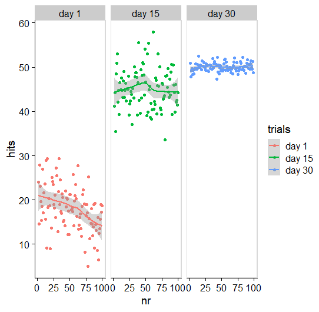
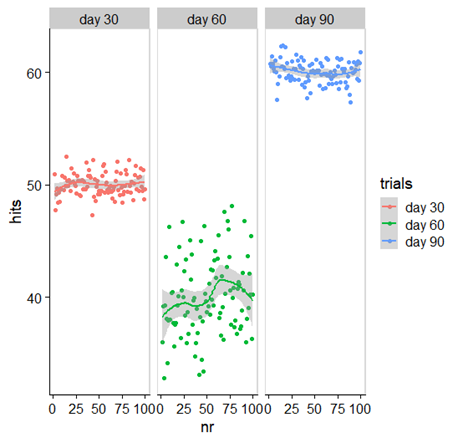
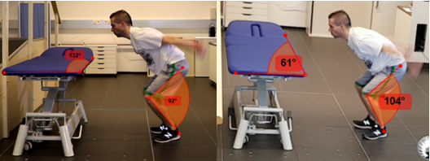

# Motorisches Lernen und Lehren {#sec-motorlearning}

Einer der offensichtlicheren Aufgaben im PT ist es, Menschen Bewegungen und Übungen beizubringen. Motorisches Lernen ist ein großes Kapitel. Wie in allen Bereichen, die wir bisher bearbeitet haben, geht es als PT\*in nicht darum jedes Detail zu wissen, sondern die Basis anwenden zu können. Die Theorien sollten wir soweit verstehen, dass wir sie im Fall der Fälle auch verständlich erklären und anwenden können.

Ziel des Kapitels ist es, dass du...

-   ... den Unterschied zwischen dem Lernen von Bewegungsverhalten und dem Lernen von Übungen verstehst und dadurch zielgerichtet die richtigen Methoden des Lehrens einsetzen kannst.
-   ... den Unterschied zwischen akuter Leistungsverbesserung und Lernen kennst.
-   ... Vor- und Nachteile von Organisationsformen (geblocktes üben, serielles üben, randomisiertes üben) aus Sicht des motorischen Lernens richtig einsetzen kannst.
-   ... verschiedene Methoden der Aufmerksamkeitsrichtung für Klient\*innen zielgerichtet einsetzen kannst.
-   ... verschiedene Feedbackmöglichkeiten einsetzen kannst -- wann, wie viel, welche Art von Feedback...

## Bewegungsverhalten oder Übungen erlernen

Ich möchte als erstes auf den Unterschied zwischen **Lernen von Bewegungsverhalten (Kategorie 1)** und **Lernen von Übungen (Kategorie 2)** hinweisen. Diese dichotome Einteilung ist rein zur Veranschaulichung gedacht und tritt in reiner Form nur selten auf. Die Einteilung soll uns helfen, dass wir uns bewusst für einen Lehrstil entscheiden können und dabei Vor- und Nachteile der Ansätze nicht aus den Augen verlieren. Die Unterscheidung wird auch so nicht in der Fachliteratur getroffen, sondern bezieht sich auf meine Beobachtung, dass eine solche (oder ähnliche Unterscheidung) als implizite Annahme den meisten Lehrkonzepten zugrunde liegt.

Unter dem **Lernen von** **Bewegungsverhalten** sollen hier sportliche Fertigkeiten (Skills) oder das Wiedererlernen von Alltagsbewegungen in der Rehabilitation verstanden werden. Unter dem **Lernen von** **Übungen** werden hier „Fitness-" oder Trainingsübungen verstanden, die eine spezielle Form aufweisen sollen, damit sie effektiv sind. Der Übergang zwischen diesen beiden Bereichen ist nicht immer klar und es gibt Überschneidungspunkte. Auf den ersten Blick scheint es so, als würden sich diese beiden Kategorien nur durch die Vertiefungsstufe des Lernens unterscheiden (z.B. [Konzepte nach Fitss oder Gentile](https://us.humankinetics.com/blogs/excerpt/understanding-motor-learning-stages-improves-skill-instruction)). Diese Unterteilung ist jedoch meiner Meinung nach nicht ausreichend.

Es gibt auch populäre Ansätze, die keinen Unterschied zwischen diesen Feldern sehen und zumeist unter die Konzepte von „Functional Training" [vor allem verbreitet seit @verstegenCorePerformanceRevolutionare2011] oder „Contextual Training" [@boschStrengthTrainingCoordination2018] fallen können. Wobei es keine Einigkeit zwischen den verschiednenen Ansätzen gibt. Der verbreitete Begriff des *Functional trainings* bleibt ohnehin nicht kritiklos [@ideThereAnyNonfunctional2021][^11-motorlearning-1]. Beide fallen aber ebenfalls in den Bereich des sportspezifischen Trainings. Auch in der Physiotherapie wird traditionellerweise häufig ein „funktioneller" Übungsansatz vorgeschlagen, der keine Grenzen zwischen den Übungen und den Alltagsfunktionen sieht [z.B. @adlerPNFPracticeIllustrated2007]. Alle diese Konzepte gehen davon aus, dass es einen starken Transfer vom Geübten zum Alltag oder zur sportlichen Leistung gibt. So soll zum Beispiel eine Übung einen Bewegungsablauf im Sport simulieren.

[^11-motorlearning-1]: Ide et al. [-@ideThereAnyNonfunctional2021] kommen zu dem Schluss, dass die Beste Definition für *Functional Training* von Fleck und Kraemer erstellt wurde. Sie nennen *Functional Training* "\[...\] training that is meant to increase performance in some type of functional task \[...\]" [@fleckDesigningResistanceTraining2014 S. 247]. Dies kann Aktivitäten des täglichen Lebens oder Sportarten beinhalten.

Eine gegensätzliche Meinung wird ebenfalls propagiert und behauptet, dass das S&C Training lediglich Energiesysteme und Strukturen vorbereiten kann, dies jedoch unabhängig von der Sportart ist. Bekannte, sehr unterschiedliche Vertreter dafür sind zum Beispiel Poliquin oder Boyle. Wobei letzterer trotzdem von functional training spricht. Der Sport muss also eigenständig betrachtet und trainiert werden. Alle diese Konzepte sind natürlich berechtigt und bieten Vorteile, zeigen sich aber nicht generell überlegen und weisen einige theoretische und praktische Schwierigkeiten auf, die auch im Fitness- und Gesundheitssport Relevanz finden.

|                                             | **Kategorie 1** **Lernen von Bewegungsverhalten**                                                                                                           | **Kategorie 2** **Lernen von Übungen**                                                                                                                                        |
|-----------------|--------------------------|-----------------------------|
| **Ziel**                                    | Bewegungen so erlernen, dass sie möglichst unterbewusst und automatisiert ablaufen können (Gehen, Laufen, Frontkick, Carving-Schwung...)                    | Übungen so ausführen, dass sie einen hohen Anspruch auf die Zielstruktur oder das Zielsystem haben (aerobes, anaerobes System, spezielle Muskeln, Faszien, Propriozeption...) |
| **Energieumsatz**                           | Minimalisieren: Ziel ist es, die Bewegung einfach und ohne übermäßigen Aufwand auszuführen                                                                  | Optimierung: Das zu trainierende System sollte (hoch) belastet werden, andere Systeme sollen geschont werden, um sie nicht zu überlasten.                                     |
| **Äußerer Fokus**                           | Zumeist ein äußerlicher Effekt in der Umwelt oder eine körperliche Leistung (maximal weit, maximal schwer, hohe Präzision, ...)                             | Zumeist ein Fokus auf Belastungs-Metrik, die nicht unbedingt maximal sein muss (Volumen, Belastungsdichte, Herzfrequenz, ...)                                                 |
| **Innerer Fokus**                           | Mit Bildern verbunden „*Fly like a butterfly and sting like a bee!*"                                                                                        | Auf „richtige Ausführung" nach vorgegebenen Standards oder nach körperlicher Wahrnehmung (maximale Muskelspannung, subjektive Belastung)                                      |
| **Vorschlag für dazu passende Lehrkozepte** | Externale Zielsetzung, Impliziter Lehrstil, (Differenzielles Lernen), Kontextualisieren der Aufgaben (*Adaptation*), Sequentielles oder randomisiertes Üben | Internale Zielsetzung, Expliziter Lehrstil, Maximale Sicherheit, keine Kontextualisierung notwendig, Blockweise oder serielle Organisation je nach Zielsystem                 |

: Bewegungsverhalten vs. Übungen erlernen {#tbl-MotL1 tbl-colwidths="\[20,40,40\]"}

In @tbl-MotL1 werden die beiden Lernziele unterschieden und der daraus propagierte Lehransatz zusammengefasst. Die Kategorie 1 beschäftigt sich mit Bewegungen, die automatisiert werden sollen, häufig kontextabhängig eingesetzt werden müssen (ein Pass muss immer etwas anders aussehen, je nach Spielsituation; ein Schritt muss dem Untergrund und der Ganggeschwindigkeit angepasst werden...) und die Bewegung sollte am Ende leichtfallen und möglichst wenig Energie benötigen. Im Training von Fitnessübungen soll die Belastung einer bestimmten Struktur (z.B. einzelne Muskeln) hoch ausfallen, damit es zu einem Anpassungsprozess kommt. Dabei ist die Ökonomie der Bewegung oft gewünscht sehr gering. Jedoch sollte die Übung so erstellt werden, dass unnötige Belastungen vermieden werden.

Im Sinne dieses Unterschieds kann das folgende Video als schlechter Bizepscurl aus Sicht Kategorie 2 oder als sehr guter Curl in Kategorie 1 betrachtet werden.



Diese Gegenüberstellung sollte dem Lehransatz entsprechend berücksichtigt werden. Die meiste Grundlagenliteratur zum motorischen Lernen beschäftigt sich mit Kategorie 1 [@magillMotorLearningControl2021; @schmidtMotorControlLearning2019]. Daraus ergeben sich auch viele Vorschläge für Personal Trainer\*innen und *Strength and Conditioning (S&C) Coaches* auf Basis der Erkenntnisse von Magill, Schmidt oder Wulf. Die genau gegensätzliche Herangehensweise wird in Systemen propagiert, die vom klassischen Bodybuilding („the pump") oder in körperzentrierten Bewegungsmethoden (Yoga, Feldenkrais...) inspiriert sind. Also wer hat recht? 

Natürlich keiner und alle. Aber um uns klar zu werden, welche Art des Bewegungslehrens wir wann verwenden wollen, müssen wir ein paar Grundlagen zu **Motor Control** **und Motor Learning** wiederholen:

## Performance vs. Learning

Eine wichtige und häufig übersehene Differenzierung ist jene zwischen **Performance (P) Leistung** und **Learning (L) Lernen** [@schmidtMotorControlLearning2019]. P bezeichnet die Fähigkeit, die jetzt im Moment vorliegt. Diese P kann sehr variabel sein und so gelingen Anfänger\*innen vielleicht 5 von 10 Basketball Freiwürfen. Eine halbe Stunde später gelingen der gleichen Person 1 von 10 oder 9 von 10.

{#fig-simA width="400"}

@fig-simA zeigt ein simuliertes Beispiel, das dir den Unterschied zwischen Lernen und Performance erklären soll. Hier macht eine Person immer 100 Versuche einer Übung und bekommt dafür Punkte. Am ersten Tag (rot) bekommt sie im Durchschnitt 20 Punkte (= P). Jede Wiederholung sieht aber anders aus. In diesem Beispiel sieht es sogar so aus, als würde sie am Ende des Tages schlechter sein als am Anfang (= P sinkt)! Trotzdem, nach 15 Tagen üben (grün) ist die Person viel besser geworden (= Lernen). Sie bekommt im Schnitt 45 Punkte (= P). Die Wiederholungen sind alle noch immer sehr unterschiedlich. Nach weiteren 15 Tagen bekommt sie im Durchschnitt nur 5 Punkte mehr, jedoch ist ihre Variabilität geringer geworden. Dies ist ein typisches Muster im Lernprozess einer Person.

Veränderungen in der Performance sind ähnlich zu akuten Auswirkungen von Ausdauer- oder Krafttraining - sie haben wenig damit zu tun, was chronisch passiert. So macht ein einzelnes Ausdauertraining vielleicht kurzzeitig müde und weniger leistungsfähig, mehrere machen jedoch langfristig ausdauernder. **Lernen** **L** ist genau dieser zweite Schritt und wird als ein langfristiger Prozess verstanden, der an sich nicht beobachtbar ist [@schmidtMotorControlLearning2019]. Bleiben wir beim Beispiel aus dem S&C so ist dir vielleicht bewusst, dass die aktuelle Leistungsfähigkeit in einem Countermovement Jump (CMJ) recht leicht manipuliert werden kann. Zum Beispiel kann das richtige Warm-up und ein gut gesetzter PAPE Effekt deine Sprungleistung stark erhöhen [@seitzFactorsModulatingPostActivation2016]. Du wirst aber nicht auf die Idee kommen, dass deine Sportler\*in nach einem guten Warm-up gelernt hat, jetzt dauerhaft höher zu springen. Dir ist bewusst, dass das ein temporärer Zustand ist. (Eine Gruppe aus Deutschland kommt in einem Review zu diesem speziellen Thema zu dem Schluss, dass es möglicherweise auch zu langzeitigen Verbesserungen kommt [@lesinskiEffekteKomplextrainingAuf2014], konnten dieses Resultat aber in einem eigenen RCT nicht bestätigen [@wallentaEinflussKomplexBlockweisen2016].

Auf eine ähnliche Weise sollte nicht angenommen werden, dass eine Person, der ich jeden Schritt einer Übung genau zeige und daraufhin die Übung am Ende der Einheit auch besser macht (P), dies auch **gelernt (L)** hat! Sie hat **lediglich P erhöht**.

::: {.callout-tip}
**MERKE: Verbesserungen in der Leistung während der Einheit, hat grundsätzlich nichts mit der dauerhaften Verbesserung der Leistung im Sinn von Lernen zu tun!**
:::

Eine weitere Änderung des motorischen Verhaltens passiert durch **Adaptionen** (Motor Adaptations). Hierunter verstehen wir zum Beispiel **Kontext** **Änderungen** [@magillMotorLearningControl2021]. Adaptionen sind feine Anpassungen in der Ausführung der Bewegung. Selbst scheinbar sehr repetitive Bewegungen oder **Closed** **Skills** sind immer leicht variabel in ihrer Ausführung. Eine typische Adaption passiert beispielsweise, wenn eine geübte Laufsportlerin schon lange nicht mehr (oder noch nie) auf einem Laufband gelaufen ist. Die ersten fünf Minuten sehen seltsam aus und fühlen sich möglicherweise für sie auch seltsam an. Die Variabilität der Schritte ist dabei anfangs hoch, dann nimmt die Variabilität ab und die Läuferin hat eine Adaption ihres Laufmusters gefunden. Steigt sie am nächsten Tag auf das Laufband, dauert der Prozess vielleicht nur noch 2 Minuten. Sie hat somit eine neue Variante ihres motorischen Verhaltens gelernt. **Adaptionen, Variabilität von Bewegungen** und **Skill Transfer** sind daher wichtig, weil sie zu interessanten methodischen Ansätzen im Bewegungslehren führen, wie zum Beispiel dem im deutschsprachigen Raum verbreiteten **Differenziellem** **Lernen** [@schollhornSystemdynamikUndDifferenzielles2015], das in den letzten fünfzehn Jahren verstärkt Kritik eingefahren hat [@kunzellDifferenziellesLehrenUnd2012]**.**

Jene Personen, die besonders gut im Adaptieren und Anpassen ihrer Bewegungen sind, fallen uns häufig als besonders begabt auf. Sie probieren eine Bewegung das erste Mal aus scheinen sie umgehend zu beherrschen.

Aus dem Beispiel der Läuferin kann noch etwas anderes herausgelesen werden. Während dem Adaptionsprozess kommt es **zu höherer Variabilität** (= die einzelnen Schritte sind sehr unterschiedlich). Dieser Prozess ist wahrscheinlich notwendig damit der Lernprozess überhaupt passieren kann. Betrachten wir zwei Trainierende, die eine neue Bewegung erlernen sollen und eine Person zeigt einmal eine sehr gute Ausführung, dann wieder eine sehr schlechte Ausführung. Bei der anderen Person sieht jede Ausführung in etwa gleich aus. Wir erwarten hier bei der ersten Person schnellere Lernerfolge als bei der zweiten [@magillMotorLearningControl2021]. Die Person, die immer die gleiche Ausführung macht hat ihre stabile Variante bereits gefunden. Diese wird schwieriger aufzubrechen und neu zu lernen sein. Sie verwendet die spontan präferierte Variante [preferred pattern, @kostrubiecBlankSlateRoutes2012]. Das ist aus einer Coaching Sicht eine wichtige Beobachtung. Bei der ersten Person tritt vielleicht Frustration durch die scheinbar vielen misslungenen Wiederholungen auf. Das sollten wir erwarten und rechtzeitig abfedern. Gleichzeitig müssen wir dieser Person wahrscheinlich auch nicht viel Feedback geben damit sie sich verbessert (siehe Kapitel Feedback). Natürlich schwanken die Bewegungen auch bei der anderen Person noch. Echten Stillstand und immer exakt die gleiche Ausführung gibt es nie! Trotzdem braucht diese zweite Person vielleicht ein paar Auslenkungen aus ihrer bisherigen Bewegung, damit sie weiter vorwärtskommt. Um das Lernen nun wieder anzukurbeln zeigt sich, dass durch **kontextuelle Interferenz** [@magillMotorLearningControl2021; @wrightNewFindingsInsights2020] bzw. durch Rauschverstärkung [@schollhornSystemdynamikUndDifferenzielles2015], also Variationen in der Umwelt oder innerhalb der übenden Person, verbessertes Lernen möglich wird. Dieser zweiten Person geben wir also einen neuen Reiz, ein neues Bild zur Übung oder ein anderes Feedback.

Betrachten wir nochmal unsere übende Person aus @fig-simA.

Nun übt sie weitere 30 Tage und merkt, dass sie stagniert. Also ändert sie ihre Technik drastisch (Kontext Interferenz). Dies äußert sich in einer kurzzeitigen Verschlechterung der Performance (grün) und ihre Variabilität steigt. Sie übt weiter und nach weiteren 30 Tagen (blau) stellt sich endlich ein neues Leistungsniveau ein @fig-simB. Ein **Regressiver Moment** kann manchmal für das Lernen notwendig sein.

{#fig-simB width="400"}

**MERKE: Verbesserungen entstehen aus Variabilität. Aufbrechen von konstanten Mustern kann nur durch Auslenkung passieren.**

## Bildliches Lernen

### Vorzeigen

Eine Übung vorzuzeigen bedeutet vor allem **Lernen am Modell**. Die Lernenden sehen die Bewegung und versuchen die Bewegung/Bewegungsprinzipien zu imitieren. Ste-Marie und Kollegen beschreiben 2012 ein generelles Modell zum Erlernen durch Beobachtung. Sie fassen die bisherige Forschungen zusammen [@ste-marieObservationInterventionsMotor2012] und überarbeiteten vor kurzem ein narratives Review dazu [@ste-marieRevisitingAppliedModel2020].

Um optimales Lernen am Modell zu erreichen, sollte das Modell **so ähnlich wie möglich** zur lernenden Person sein. Ähnlichkeiten in Gender, Alter oder Körpermaße sind relevant. Aber sogar die Expertise des Modells kann einen Einfluss haben. So ist es für absolute Anfänger nicht unbedingt vorteilhaft von einem Profi zu lernen, sondern von jemanden, der/die nur leicht über ihrem Erfahrungslevel steht. Es zeigt sich sogar manchmal, dass es Vorteile haben kann, wenn das Modell selbst noch kleine Varianten oder Fehler macht, diese erkennt und versucht diese auszubessern. Auch die Art wie das Modell über sein eigenes Können und seine Verbesserungen spricht ist entscheidend.

Das sogenannte **Learning und** **Coping** **Modell**, das selbst noch lernt und ihre eigenen Schwierigkeiten und Lernstrategien anspricht, hilft vor allem Lernenden selbst eine höhere Zuversicht und Motivation gegenüber dem eigenen Lernprozess zu bekommen. Ein **Skilled und** **Mastery Modell** (zeigt immer perfekte Bewegungen und hat keine Zweifel am Können) auf der anderen Seite, führt eher zu besserem motorischen Lernen aber unterstützt weniger die self-efficacy.

Einer Person, die eher damit Schwierigkeiten hat zu glauben, dass sie die Bewegung erlernen kann und daher motivationale Probleme hat, zeigt die Trainerin ein ähnliches Modell, das am Anfang auch Probleme hatte und langsam besser wird/wurde. Geht es rein um die technischen Schwierigkeiten, ist es zumeist hilfreicher die „perfekte" Ausführung zu zeigen. Darüber hinaus kann aber ein Learning Coping Model auch geeignet sein, um ein aktives Problem-lösen oder kreatives Handeln zu forcieren. Noch erstaunlicher ist, dass Ste-Marie und Kollegen [-@ste-marieRevisitingAppliedModel2020] beschreiben, dass bei Modellen, die der lernenden Person nicht ähneln, ein Coping Model immer dem Mastery Model sowohl motorisch als auch psychologisch überlegen ist! Bei der Beobachtung unterschiedlicher Modelle sollte immer auf das Skill-Level der Person hingewiesen werden.

Hier sehen wir ein paar Probleme im Personal Coaching. Oft haben wir Kund\*innen, die uns als Trainer\*innen sehr unähnlich sind (Alter, Fitnesslevel, Geschlecht...). Welche Strategien fallen dir ein um dieses Problem zu minimieren?

-   Kleingruppentraining
-   Zeigen der eigenen Leistungen
-   Videomaterial von anderen Übenden
-   Auf ausführliche Demonstrationen durch die PTs verzichten und andere Cues verwenden
-   Eigene Lernfelder und Lernprozesse aufzeigen
-   ...

### Lernunterstützung qualitative Videoanalyse

Die Möglichkeit videounterstützt zu Arbeiten sollte genutzt werden. Bei Verwendung von Smartphones sollten wir aber immer die Schwierigkeiten des **Datenschutzes** beachten. Gerade auch in öffentlichen Fitnessstudios sollte außerdem die Privatsphäre andere Besucher\*innen gewahrt werden! Bitte, lade keine Videos von anderen Personen (Klient\*in oder nicht) ungefragt auf öffentliche Plattformen hoch! Get your Ethics straight @sec-ethikschuetzt.

Die hier dargestellte Methode zur qualitativen Videoanalyse stützt sich praktisch auf dem Buch *Qualitative Diagnosis of human movement* [@knudsonQualitativeDiagnosisHuman2013], wurden jedoch inhaltlich mit den neueren Ergebnissen von Ste-Marie at al. [-@ste-marieRevisitingAppliedModel2020] und Grundlagenliteratur [@magillMotorLearningControl2021] verglichen.

Nimm immer mehrere Wiederholungen auf (5-8+). Achte darauf, dass die ganze Person im Video zu sehen ist. Wenn du auch einfache **quantitative Tools** einsetzen möchtest, achte auf **Parallaxenfehler** (@fig-Paralax) und wähle einen optimalen Winkel zur Analyse (90° zur Bewegungsrichtung). Die Aufnahmefrequenz sollte nach dem Nyquist Theorem gestaltet sein (Siehe Biomechanik und Sportinformatik Vorlesungen).

{#fig-Paralax width="400"}

Aus der Sicht des motorischen Lernens ist es wohl besser (wenige Studien dazu), wenn das Video die Person frontal (*objectiv view*) oder von hinten (*subjectiv view*) zeigt, nicht von der Seite oder einem anderen Winkel. Aus praktischer Sicht sollte man sich hier jedoch vor allem nach der gezeigten Bewegung und der Zielkorrektur richten.

Achte darauf, dass du die Aufnahme früh genug startest. Bei Kraftübungen empfiehlt es sich auch die Vorbereitung und Nachbereitung der Übung zu filme (aufheben und ablegen der Hanteln). Gerade in diesem Zeitfenster passieren oft die ersten Fehler, die potentiell zu Verletzungen führen können.

Die Kamera ist bei Bewegungsaufnahmen möglichst immer statisch! Daher brauchst du zum Beispiel bei Laufübungen viel Abstand zwischen Kamera und übender Person (bis zu 20m).

Es empfiehlt sich aus zwei Betrachtungswinkel zu filmen. In der Praxis ist das meist schwierig. Wähle die wichtigste Ansicht zuerst. Dafür muss dir im Vorhinein klar sein, worauf du deinen Coachee hinweisen möchtest.

Wenn du der Person das Video zeigst bietet sich folgendes Vorgehen an:

1.  Zeige erst das ganze Video in normaler Geschwindigkeit und ohne Kommentar. So kann die Person einen Überblick gewinnen und sich auf die Ansicht einstellen. (Manchmal kommt von Kund\*innen als erstes „Oh Gott ,wie schau ich denn aus!". Das ist nicht hilfreich, wenn es um Bewegungsqualität geht und du ihr eigentlich etwas erklären willst. Also lass der Person erst mal Zeit.)
2.  Gib deinem Coachee dann konkrete Hinweisen dazu, auf was sie schauen soll. Denke daran - *weniger ist mehr* -- und zeig ihr das Video noch ein paar Mal in normaler Geschwindigkeit und ohne Zoom. (Langzeitlernen lässt sich durch Hinweise wahrscheinlich nicht verbessern, aber es hilft Kurzzeit P zu verbessern).
3.  Falls es noch notwendig ist, kannst du Zoom und Zeitlupe zu Hilfe nehmen, um auf deine Punkte oder auf Fragen genauer einzugehen. (Bei manchen Untersuchungen zu Krafteinsatz und optimalen Timing einer Bewegung stellt sich Slow-motion sogar als negativ heraus, bei komplexen Bewegungsabfolgen als positiv.)
4.  Lass der Person etwas Verarbeitungszeit und lass sie dann die Bewegung nochmals probieren.
5.  Wenn du ein zweites Modell hast, ist das in jedem Fall vorteilhaft dieses zusätzlich zu zeigen. Zum Beispiel kannst du deine Variante als **Skilled Model** zeigen. Achte darauf, dass beide Videos die gleiche Ansicht zeigen. Ob du sie dann übereinanderlegst oder nebeneinander präsentierst ist nicht so wichtig. Wenn du sie hintereinander zeigst, zeige sie möglichst abwechselnd.
6.  Manche PTs geben den Trainierenden die Kameraaufnahme zum eigenständigen abspielen und zeigen gleichzeitig die Übung selbst, live vor. Dies scheint mir eine gute Strategie zu sein. Studien, die genau diese Variante verwenden sind mir nicht bekannt.
7.  Lass deine Coachees selbst wählen wie oft sie videogestütztes Feedback bekommen. Dies scheint deutlich besser zu sein, als einer Person ungefragt Feedback Videos zu geben!

## Lernstrategien - Lernmodelle

### Implizites Lernen

In den letzten Jahrzehnten kamen implizite Lernstrategien gegenüber expliziten mehr und mehr in Mode. In drei verbreiteten Lehrbüchern von Magill [-@magillMotorLearningControl2021], Schmidt [-@schmidtMotorControlLearning2019] und Gollhofer [-@gollhoferRoutledgeHandbookMotor2012] wird implizites Lernen als überlegen dargestellt und von den Author\*innen für das **Lernen von Bewegungsverhalten** empfohlen.

Implizites Lernen geht von der Idee aus, dass der anfänglich hohe kognitive Aufwand zum Erlernen einer neuen Fertigkeit oder Fähigkeit umgangen werden kann, indem von Anfang an auf **unterbewusste oder automatisierte Strategien** gesetzt wird. Es wird daher zum Beispiel nicht exakt beschrieben oder gezeigt, wie der Arm bei einer Bewegung geführt wird. Anstelle dessen werden Bilder oder Analogien verwendet und damit ein **externaler Fokus** und **Knowledge of Results** gesetzt. Anstelle Übungen so zu gestellten, dass sie kognitiv analysiert werden können und die Personen Zeit und Aufmerksamkeit auf einzelne Aspekte setzen können, werden von Anfang an **Dual-Task** Aufgaben gesetzt, die ein „Zerdenken" der Bewegung verhindern.

Nach Meinung von 49 Expert\*innen in einem Delphi Prozess ist jedoch nicht klar, welche dieser Strategien wirklich mehr explizit oder mehr implizites lernen aktivieren [@kleynenUsingDelphiTechnique2014]. Theoretisch sollte es jedenfalls durch implizites Lernen schneller möglich werden, dass die Übenden ein automatisiertes Bewegungsverhalten im Alltag oder im Chaos eines Spiels umsetzen können (@fig-ImpExp).

{#fig-ImpExp width="400"}

In einem systematischen Review zeigten Kal et al. [-@kalDoesImplicitMotor2018], dass implizite Lernstrategien (vorrangig Analogien und externaler Fokus) Vorteile haben können. Besonders im Sinne des Langzeitlernens zeichnen sich Unterschiede ab. Die Studienlage ist jedoch sehr begrenzt und eine Risk of Bias Analyse fiel hier unklar aus. Die Autoren beschränkten sich auf das Maß der Automatisierung der Bewegung. Gollhofer und Kollegen [-@gollhoferRoutledgeHandbookMotor2012] beschreiben ihrerseits viele Studien, die Vorteile von implizitem Lernen zeigen, wenn es zum Beispiel zu Handlungen unter Ermüdung kommt. Masters et al. [-@mastersAdvancesImplicitMotor2020] beschreiben ebenfalls einige Vorteile für Personen mit eingeschränkten kognitiven Fähigkeiten oder bei Kindern.

Insgesamt sind jedenfalls keine negativen Effekte durch implizite Lernstrategien zu erwarten. Die meisten Abhandlungen von Expert\*innen raten stark zum Einsatz von implizitem Lernen, auch wenn systematische Reviews scheinbar kaum vorhanden und mit spärlicher Evidenz aufwarten können. Aus eigener Erfahrung bedarf es aber ein höheres Maß an Expertise und Kreativität die Inhalte mit impliziten Lernstrategien anzubieten.

Implizite Strategien [mastersAdvancesImplicitMotor2020]:

-   Fehlerreduziertes Üben:
    -   Übungen werden so leicht gestaltet, dass es kaum zu Fehlern kommt und die Übenden einfach die Bewegung machen können ohne zu denken. Dann erst werden die Übungen stufenweise erschwert
    -   Im Personal Coaching findet diese Methode wohl vorrangig bei koordinativen Übungen Einsatz. Aber auch bei higher-risk Übungen (Clean, Snatch...) ist es wohl angebracht fehlerreduziertes Üben einzusetzen
-   Analogien / mit mentalen Bildern arbeiten:
    -   Es werden mentale Bilder (Tiere, geometrische Figuren, analoge Bewegungsmuster, Töne...) eingesetzt um die Bewegung zu verdeutlichen
    -   Analogien sind aus meiner Erfahrung auch sinnvoll, weil sie gut erinnert werden können (und sie sorgen oft für ein paar Lacher im Training). Später reicht oft ein einzelnes Wort und die Klient\*innen können die Übung nach dem mentalen Bild durchführen.
    -   Beispiele finden sich bei vielen der Oldschool Praktikern wie Pavel Tsatsouline oder Dan John. (Bankdrücken: „Brich die Stange", Kniebeuge: „Zerreiße den Boden mit den Füßen!", Single Leg RDL: „Wie eine Kinderwippe", Kettlebell Snatch: „Reißverschluss zuziehen.", Springen: „Lande wie eine Katze" ...
-   Externaler Fokus der Aufmerksamkeit:
    -   Dieser Punkt wird von Masters unter implizites Lernen gesetzt. Gabriele Wulf, die viele der Studien durchgeführt hat, beschränkt sich jedoch nicht auf diese Einteilung.
    -   Unabhängig davon wurden viele Studien zu externalem Fokus durchgeführt und die Ergebnisse scheinen recht konsistent. Externaler Fokus ist für das Lernen fast immer besser als internaler!
    -   Es wird dabei nicht der Fokus auf den Körper oder die Bewegungen des Körpers gelenkt, sondern auf äußere Effekte der Bewegung oder auf Instrumente.
    -   Z.B. Langhantel Press: Internal = „Streck die Arme"; „Spann den Trizeps", External = „Drück die Hantel zur Decke"
-   Dual Task Learning:
    -   Hier werden von Anfang an Dual Task Aufgaben eingebaut.
    -   Dies macht aus meiner Sicht besonders dann Sinn, wenn Personen Übungen unaufgefordert „zerdenken". Gleichgewichtsübungen können zum Beispiel manche Personen mental sehr fordern. Sie beginnen über die richtige Beinachse oder das Fußgewölbe nachzudenken (=meist internaler Fokus). Um das zu verhindern könnten zusätzliche motorische oder kognitive Aufgaben gestellt werden (miteinander reden, einen Ball zuwerfen...).

### Explizites Lernen

Seit Jahrzehnten werden von führenden Denkern im Bereich Motor Control und Motor Learning Modelle vorgeschlagen, die Stufen des Lernens beschreiben. Diese basieren zumeist auf einem **expliziten Lernmodell**. Eine Einstufung hat in der Praxis den Vorteil, dass möglicherweise erkennbar wird wann welches Verhalten und welche Verbesserungen eintreten. Es hilft uns auch die richtige Lehrstrategie zu wählen. So beschreiben schon Fitts und Posner 1967 ein dreistufiges Modell, das von einer **Kognitiven**, einer **Assoziativen** und einer **Autonomen/Automatisierten** **Phase** spricht. Die beschriebenen Strategien zum Erlernen decken sich Großteiles mit modernen Ansätzen.

{#fig-Spampinato width="400"}

Aktuell unterscheidet man vier Lernstrategien im expliziten Lernen [@spampinatoMultipleMotorLearning2021]:

-   Error Based Learning:
    -   Fehler erkennen und korrigieren. Ist besonders am Anfang der Lernphase wichtig und führt zu schnellen (jedoch weniger dauerhaften) Verbesserungen
    -   Führt zu hoher Variabilität der Ausführung
    -   Wiederholtes, direktes Feedback für Anfänger\*innen ist die Methode der Wahl
    -   Das Feedback sollte direkt durch das Ergebnis erfahrbar sein, da es auch um quantitative Abweichungen geht (wie weit ist der Ball daneben geflogen)
-   Use-Dependent Learning:
    -   Am besten zu beschreiben durch den bekannten Spruch „practice makes permanent"
    -   Wiederholen von Bewegungen führt zum „einschleifen". Dadurch wird die Strategie vermehrt eingesetzt.
    -   Selbst bei Fehlern wird die Bewegung nicht korrigiert
    -   Sollte erst in einer späteren Phase des Lernens, wenn die Bewegung bereits zu einem hohen Maße beherrscht wird, eingesetzt werden. Es führt dann jedoch zu höherer Präzision, Automatisierung und geringerer Reaktionszeit. Das ist notwendig im Sport und für das Entstehen von **Flow** **Erlebnissen.**
-   Reinforcement Learning:
    -   Die Person muss Bewegungen erforschen, um die besten Erfolge zu finden und versucht diese dann zu reproduzieren.
    -   Durch das Erkennen von erfolgreichen Wiederholungen kommt es zu geringerer akuter Verbesserung, aber das Behalten (**retention**) ist dafür länger als beim Error based learning.
    -   Positive Verstärkung bei gelungenen Bewegungen ist die Methode der Wahl. Die Wichtigkeit der Methode steigt mit dem Grad des Fortschritts der lernenden Person
-   Strategy Learning:
    -   Kognitive Prozesse in Bezug auf die Übung/Bewegung. Trainierende müssen Bewegungsabfolgen verstehen, verinnerlichen und Abrufen und oft auch mehrere Bewegungen gleichzeitig starten.
    -   Die richtige Sprache und das Verwenden von Schlüsselwörtern/-phrasen sind die richtige Strategie zur Unterstützung.

### Update (08-2024)

Mögliche zukünftige Updates sollten die aktuelle Diskussion und Evidenz berücksichtigen (z.B. [Nevo et al., 2024](https://peerj.com/articles/17718/)).

## Organisationsformen im Motorischen Lernen

Wie im S&C Training, gibt es auch beim Lernen die Möglichkeit für längere Zeit bei einer Übung zu bleiben (**geblocktes üben**), Übungen abwechselnd oder in einer Art Zirkel zu machen (**serielles üben** @fig-seriell) oder die Übungen in zufälliger Reihenfolge zu machen (**randomisiertes üben**). Vielleicht hast du nach all den Informationen schon eine Idee wie sich welche Form auf die akute P und auf langzeitiges L (retention und transfer) auswirken könnte...

Es zeigt sich fast uneingeschränkt, dass serielles und randomisiertes üben zu besseren Retention und Transfer-tests führt (= besseres lernen). Geblocktes lernen führt zu höherer akuter Leistung [@wrightNewFindingsInsights2020]. Diese Erkenntnis ist für Trainierende oft schwer vorstellbar. Viele motivierte Kund\*innen, die Übungen ganz genau lernen wollen, halten es für wichtig lange und ganz intensiv beim Coaching einer Übung zu bleiben. Es bedarf manchmal einer Erklärung dazu, dass zufälliges auswürfeln der nächsten Übung der beste Weg wäre, um sich die Ausführung aller Übungen zu merken.

{#fig-seriell with="400"}

Spätestens hier sollte dir auch auffallen, dass Empfehlungen für optimales **Training** (zum Beispiel Stationstraining für Muskelaufbau) nicht unbedingt mit Empfehlungen für **motorisches Lernen** übereinstimmen. Als Personal Trainer\*in ist es also deine Aufgabe dir zu überlegen was für individuelle Klient\*innen in der aktuellen Situation der wichtigere Faktor ist. Darüber hinaus soll gesagt sein: auch randomisiertes Training kann Muskeln aufbauen und auch Block Üben kann Lernen anregen.

## Feedback -- aber wie viel

Nach erfolgreicher Bewegungsausführung geben Coaches Feedback zur gelungenen Technik, um so ein besseres Lernen zu gewährleisten (und ihren Job zu rechtfertigen 😉). Jedoch bekommen Trainierende nicht nur durch die Trainer\*in Rückmeldung. Erstens bekommen die Klient\*innen Feedback über die erbrachte externe Wirkung, die sie erzeugt haben. Wurde das Gewicht bewegt, wurde die geforderte Arbeit am Ergometer gefahren, stehe ich noch immer einbeinig auf dem Wackelkissen... Dies wird als **knowledge of results** bezeichnet. Zweitens bekommen sie Feedback durch ihren Körper. Hier gilt leider oft die Devise des Körpers: „Nichts gesagt ist Lob genug". Denn dieser meldet sich mittels Schmerzen nur dann, wenn etwas nicht stimmt. Geübte Trainierende bekommen aber auch ein Gefühl dafür, wenn sich eine Bewegung gut anfühlt. Sie verleihen diesem Gefühl auch verschiedenartig Ausdruck: die Bewegung fühlt sich dann zum Beispiel *rund, weich* oder *einfach* an. Dies wird als **knowledge of performance** bezeichnet. Der Job der PTs ist es diese Art des eigenen Feedbacks zu verbessern, indem sie zusätzliche Rückmeldungen anbieten. Dieses äußere Feedback soll aber das innere Feedback nicht ersetzen, sondern eben helfen das innere Feedback zu verstehen.

Praktische Zusammenfassung von Feedbackgabe nach Grundlagen des motorischen Lernens:

-   Weniger ist mehr (Guidance Hypothese nach Schmidt)
    -   Diesen Rat geben alle Grundlagenwerke, die bisher zitiert wurden. Gerade für Retention- und Transfertests ist es wahrscheinlich vorteilhaft weniger, geblocktes Feedback, und mit zunehmenden Leistungslevel immer weniger zu geben.
    -   Eine umfangreiche Meta-analyse [@mckayMetaanalysisReducedRelative2022] versuchte genau diese Hypothesen zu testen. Die Analyse von McKay fand ein sehr breites 95%CI für die gepoolten Effekte und es scheint einige Covariaten zu geben, die zu unterschiedlichen Effekten führen. Diese wurden aber in der Analyse nicht eindeutig identifiziert. Der wahre Effekt liegt also weiterhin im Dunkeln. Für Praktiker\*innen reicht bis auf weiteres: Weniger ist mehr!
-   Lass die Übenden aktiv Feedback einfordern
    -   Auch dieser Rat zieht sich durch die gesamte Literatur. Feedback zu ziehen, verbessert jedoch nicht nur das motorische Lernen. Es ist ist auch ein entscheidender Faktor in den Bereichen Selbstwirksamkeit, Selbstbild und Motivation. Lass also deine Kund\*innen entscheiden wann und wie oft du Rückmeldung gibst.
-   Zeitlich muss Feedback nicht sofort gegeben werden. Lass erst Lernende selbst über die Leistung reflektieren.
-   Passe die Präzision des Feedbacks an das Leistungslevel an (**Bandwidth Feedback**).
    -   Einzelne Studien zeigen, dass zu hohe Präzision im Feedback überfordert. Wenn die Wiederholungen in einem guten Rahmen sind, reicht es dies zu bestätigen/verstärken. Liegt eine Abweichung vor reicht oft „zu weit"/"zu viel", anstatt präzisen Angaben. Diese kommen erst bei Fortgeschrittenen in Spiel.
    -   Auch dieser Punkt wurde bei McKay et al. [-@mckayMetaanalysisReducedRelative2022] miteinbezogen und konnte nicht voll bestätigt werden.
-   Gib mehr positives Feedback als negatives. (Was ist gelungen vs. Was ist nicht gelungen)
-   Mische **Knowledge of Results** mit **Knowledge of Performance**
-   Richte einen externalen Fokus der Aufmerksamkeit
-   Identifiziere die kritischen Punkte der Übung
-   Geblocktes Feedback über mehrere Wiederholungen (@fig-block) ist oft gleichwertig oder besser als Feedback nach jeder Wiederholung.

{#fig-block width="400"}

 Hier erscheint in Kürze: "Lernen unter Ermüdung" und "Schlaf und Motorisches Lernen" 

## Weiterführende Literatur

Eine praxisorientierte Zusammenfassung mit wunderbaren Bildern und Coaching Cues findet sich bei [Nick Winkelman -- The Language of Coaching](https://www.thelanguageofcoaching.com/).

## Literatur
