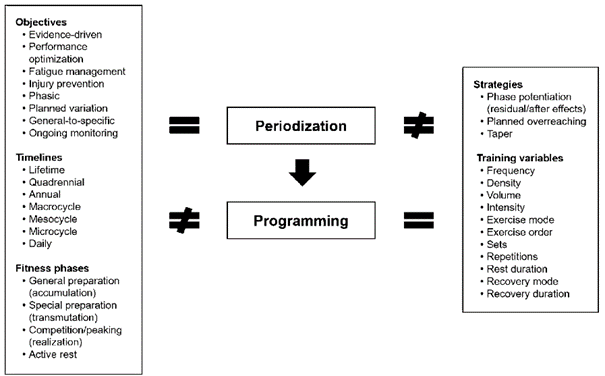
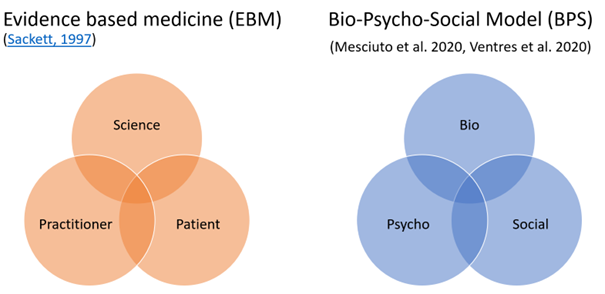
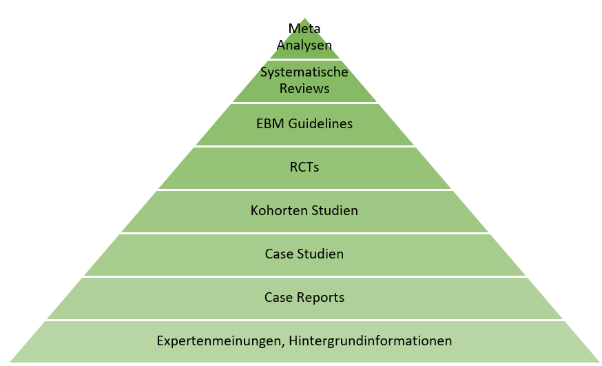
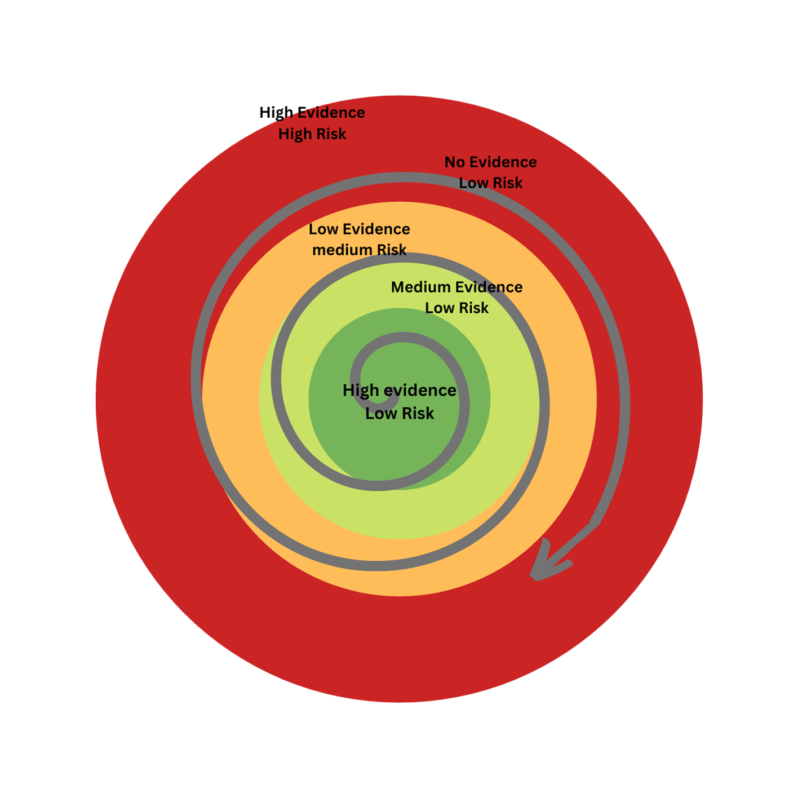
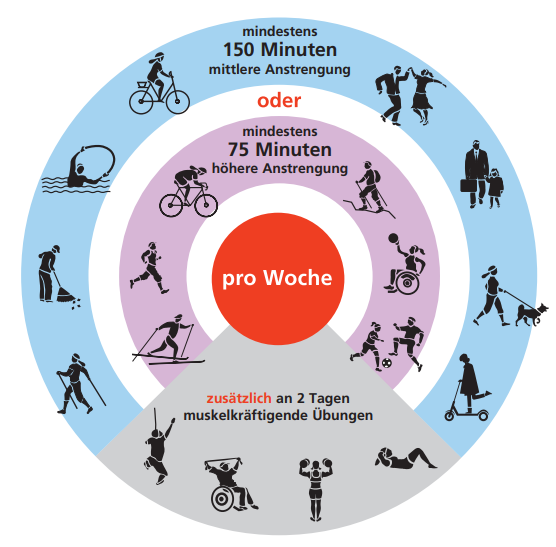
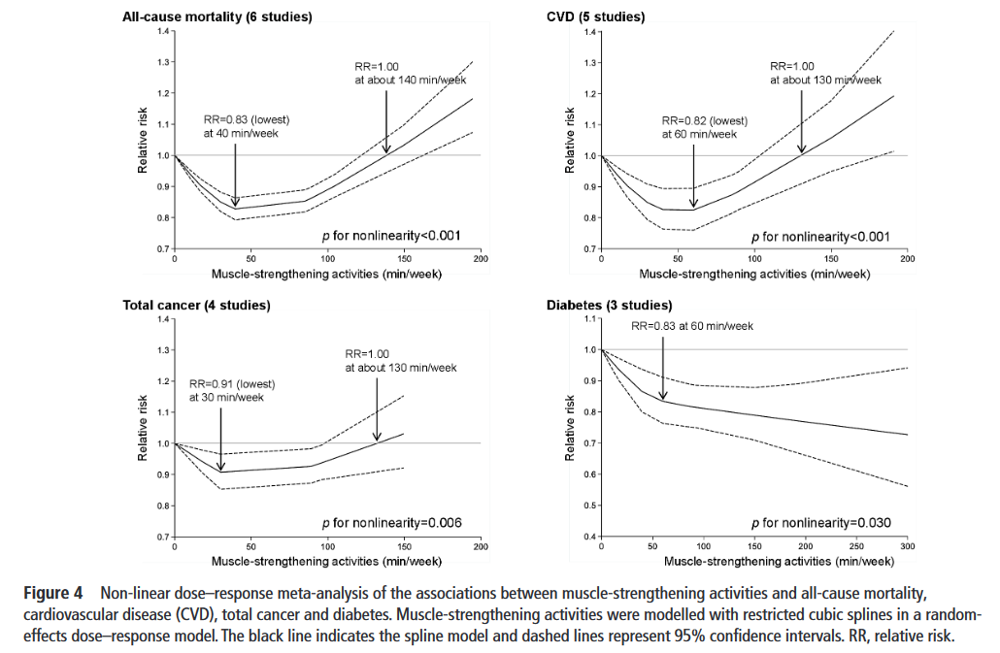

# Trainingsplanung und -steuerung im Personal Training {#sec-trainingsplanung}

Trainingswissenschaft und Trainingslehre sind eine der umfangreichsten Unterrichtseinheiten in den meisten Personal Training Ausbildungen. Warum nicht in diesem Kurs?

Der wichtigste Grund dafür ist, dass angenommen wird, dass Du als Student\*in der Sportwissenschaft bereits umfangreiches Wissen in anderen Lehrveranstaltungen gesammelt hast. Aus Erfahrung interessieren sich die meisten Sportwissenschafter\*innen ohnehin stark für Trainingslehre, die im Selbststudium über durch Bücher, Kurse, Videoplattformen und Eigenerfahrung recht „leicht" erlernt werden kann. Selbst Laien können sich heute schnell das wichtigste Wissen um Übungsausführung und Trainingsplanung aneignen. Wahrscheinlich ist die Trainingssteuerung jener Zweig, der schwieriger zu beherrschen ist und zu dem auch weniger frei zugängliche Information im Netz zur Verfügung steht.

Was sind die Ziele dieses Kapitels?

-   Kritisches Hinterfragen der gängigen Planungskonzepte für Personal Training
-   Herunterbrechen von Zielen der Kund\*innen auf die kleinste Organisationseinheit in der Planung: einzelne Trainingseinheiten
-   Üben einen Trainingsplan zu erstellen und anzuwenden
-   Wie kann ich Fortschritte sichtbar machen? -- reliable, objektive und valide Testungen

## Kritisches Auseinandersetzen mit bekannten Trainings-Prinzipien

In diesem Unterkapitel spielen wir *advocatus diaboli* und nehmen uns ein paar der weit verbreiteten Trainingsprinzipien genauer unter die Lupe.

### Testen und Messen -- kritisch hinterfragen

Eine fast universelle Regel ist, dass Trainer\*innen möglichst präzise und akribisch den Ist-stand der Trainierenden testen sollen, um daraus die Trainingsplanung zu gestalten. Nach einer angemessenen Zeit werden die Variablen wieder bewertet.

Warum sollten wir deiner Meinung nach Ziele objektivierbar machen, um dann zeitlich wiederholte Testungen durchzuführen?

Mit den Worten des viel vergötterten Managers Peter Drucker: „What gets measured gets managed".[^12-programing-1] Dies wird auch auf den Umgang mit Menschen umgelegt -- egal ob bei Bildungszielen und vergleichbaren Bildungstests (siehe Zentralmatura), in der Reha oder im Training (Spiroergometrie, Krafttests, Körperzusammensetzung...). Überall folgen wir der Leitidee nach Drucker. Daraus ergibt sich aber auch im Umkehrschluss eine mögliche Verzerrung der Inhalte, Ziele und der Interpretation der Ergebnisse. Denn es verbessert sich auch nur das was wir messen. Alles was Training kann und nicht gemessen wird, wird abgewertet oder wird völlig aus den Augen verloren. Was passiert also mit den Kund\*innen die „einfach fitter" werden wollen. Wir als Trainer\*innen münzen dies jedoch um auf die Verbesserung der 5Rm Kniebeugen und des 2000m Ruderergometertests?

[^12-programing-1]: Peter Drucker hat das übrigens wahrscheinlich nie gesagt und dieser Artikel <https://www.drucker.institute/thedx/measurement-myopia/> beschreibt ein ganz anderes Bild. Aber Peter Druck, Albert Einstein Buddha und Warren Buffet kassieren wohl viele falsche Zitate .

Wenn sich die Kund\*innen schließlich darin auch wirklich verbessern, sind sie zumindest zufrieden. Verbessern sie sich nicht, haben aber endlich Freude an Bewegung gefunden, Blutwerte und Schlaf sind verbessert, können sie diese Änderung nicht wahrnehmen. Was nicht gemessen wurde, wurde mental diskreditiert und fällt nicht auf.

Für die folgende Übung bitte ich dich, dass du alle Wirkungen niederschreibst, die ein gutes Training auf einen Menschen haben kann. Mach dir keine Sorgen, wenn du nicht die aktuelle Evidenzlagen dazu kennst und dir nicht unsicher bist. Probiere es einfach mal aus - Was kann Training alles bewirken?

Hast du alles? Hier noch ein paar Denkanstöße: Herzkreislaufsystem (Herz, Blutgefäße, Blut), Stoffwechsel, Immunsystem, Bewegungsapparat (Knochen, Sehnen, Muskeln, Faszien), Psychisches (Kognition, Emotionen, Selbstbild...), Schmerzverarbeitung, Soziales, Schlaf, Körperzusammensetzung, äußeres Erscheinungsbild, selbst wahrgenommenes Erscheinungsbild, ...

Ok, wenn du dir etwas Zeit genommen hast, dann sollte deine Liste ziemlich lang sein. Nun, wieviel davon kannst du als Trainer\*in realistischerweise, mit dir zugänglichem Equipment messen? Nicht gerade viel, oder?

Das Problem entsteht damit auf zwei Ebenen. Zum Ersten bedeutet das, dass wir notgedrungen unsere Trainingsprinzipien und -pläne auf jene Dinge ausrichten, die wir einfach messen können. Andere Ebenen bleiben unterrepräsentiert und in der Praxis (teilweise auch in der Forschung) weniger bekannt. Manche Dinge können wir mit subjektiven Skalen gut abdecken. Das funktioniert aber auch nur in jenen Bereichen, in denen subjektive Empfindungen auch entscheidende Outcomes sind (z.B. Gelenksverscheiß vs. Schmerzen im Gelenk).

Zweitens bedeutet das auch für Trainierende, dass ein Training (oder allgemein Bewegung) nur dann effektiv und hilfreich ist, wenn es diese messbaren und sichtbaren Variablen verändert. Wir verändern als Trainer\*innen und Forscher\*innen den Fokus der Gesellschaft durch unsere Messungen. Wenn alle Praktiker\*innen ihre Trainings mit „verringerter Bauchumfang" auf ihrer Homepage bewerben, so wird dies zum entscheidenden Outcome durch Training.

Dazu kommt noch die Schwierigkeit, dass die Effektivität von Training (auf die gemessenen Outcomes) individuell und zeitlich sehr variabel ist. Die Frage nach Trainierbarkeit einzelner Individuen ist noch lange nicht vollständig geklärt. Aber es kann angenommen werden, dass sich der Anteil der non-responder [^12-programing-2] im zweistelligen Prozentbereich befindet [@bouchardAdverseMetabolicResponse2012; @robertsPhysiologicalDifferencesLow2018].

[^12-programing-2]: Ich verwende hier bewusst den Begriff Non-Responder aus reinem Pragmatismus und um die Problematik noch klarer darzustellen. Es geht um für die gemessenen Variablen in einem relevanten Zeitraum! In Wahrheit sollte *responsivness* nicht als fixer Bestandteil einer Person (*trait*) sondern wohl eher als ein zeitlich begrenzter und auf einen Faktor bezogenen Zustand (*state*) betrachtet werden.

Nicht alle deine Kund\*innen werden also durch das Training, das du ihnen bieten kannst auch wirklich Verbesserungen erzielen. Jedoch kann es sehr wohl sein, dass Personen in anderen, nicht gemessenen Bereichen Verbesserungen erzielen[@bouchardAdverseMetabolicResponse2012; @karavirtaIndividualResponsesCombined2011; @radakIssuesTrainability2021].

Die Frage ist dementsprechend, ob wir Training an sich nicht auch falsch vermarkten!

Natürlich brauchen wir weiter Anhaltspunkte für unsere Trainingssteuerung. Wenn keine gewünschten Ergebnisse erzielt werden, sollten wir nicht automatisch davon ausgehen, dass es sich hier um reduzierte Anpassungsfähigkeit handelt. Zuerst sollten wir immer nach Verbesserungen im Training oder in anderen Zubringersystemen (Ernährung, Regeneration) suchen. Gleichzeitig ist es wichtig, dass wir unseren Klient\*innen neben der Verringerung des Bauchumfangs oder der verbesserten Bankdrückleistung auch andere Marker für Verbesserung anbieten können.

Alternativ können wir beginnen alles zu messen und zu tracken, was uns möglich ist und nach angemessener Zeit betrachten was sich verbessert hat. Dieser Ansatz ist für die Trainer\*innen ein sehr praktischer und bietet sich wunderbar an, um die Markttrommel zu schlagen. Durch die Verbreitung von Wearables und Tracking-Devices wird dies auch immer einfacher. Auch diese Handlungsweise hat ihre Tücken. Messen wir möglichst viele Variablen können wir sicher sein, dass sich irgendeine verbessern wird. Leider liegt das dann nicht unbedingt an einem erfolgreichen Trainingsprozess, sondern entsteht durch Zufall. Dieser Gefahr setzten wir uns besonders aus, wenn wir auch kleine Verbesserungen sofort als relevant werten. Wir sollten zumindest a priori einen minimalen messbaren und relevanten unterschied festlegen (Franco et al., 2016). Nur wenn sich unserer Kund\*innen darüber hinaus verändern, sollten wir von einer „echten" Anpassung ausgehen. Anders entsteht daraus eine sehr unehrliche Praxis.

Wie denkst du, können wir vorgehen? Findest du einen optimalen Weg zwischen *alles testen* und *nichts testen* und ins Blaue hinein trainieren?

Eine Lösung des Problems ist, sich nochmal neu zu überlegen, wie Ziele definiert werden und wie wir mit Klient\*innen über das Erreichend dieser Ziele sprechen. Es ist eine schwierige Angelegenheit, aber die ehrlichere Variante. Wir können die letztendliche Anpassung der Kund\*innen nicht vorhersehen und sollten solche Anpassungen auch nicht als Ziele definiere (outcome goas). Die Ziele werden vielmehr als Handlungen (process goals) definiert. Darüber haben wir mehr Kontrolle und diese sollten auch gemessen und gemanaged werden. Wenn dies für alle Beteiligen klar ist, können Trainingsleistungen trotzdem „on the fly", also während dem Training und nur zum Zweck der Trainingssteuerung gemessen werden. Es werden also keine spezifischen Tests durchgeführt, die den Trainingsprozess unterbrechen, Zeit und Ressourcen kosten und oft hoch belastend sind. Anstelle dessen werden Daten währende dem Training erhoben.

### Periodisierung im Personal Coaching

Eine der einflussreichsten und universellsten Theorien im Training ist die Periodisierung von Trainingsinhalten. Aufbauend auf den Konzepten der Stressreaktion nach Hans Selye (1975), hat sich die Trainingswissenschaft ein Modell zurechtgezimmert, das von Ermüdung und Erholung des Organismus ausgeht (Cunanan et al., 2018). Darauf aufbauend werden durch zyklisches planen und steuern von Training versucht, eine optimale Anpassung und Leistungsspitzen termingerichtet zu erreichen. Dies wird als **Periodisierung** bezeichnet. Darunter seht die Steuerung der einzelnen Elemente (Übungen und Belastungsparameter), was als **Programming** bezeichnet wird [@bompaPeriodizationTheoryMethodology2019; @cunananGeneralAdaptationSyndrome2018; @stonePeriodizationBlockPeriodization2021]. Für einen Versuch der Begriffsdefinition siehe @fig-peridprogram.

{#fig-peridprogram width="400"}

Aufbauend auf diesem Gerüst, das immer wieder konzeptuelle Kritik erfährt [@bucknerGeneralAdaptationSyndrome2017; @kielyPeriodizationTheoryConfronting2018], haben Trainer\*innen und Wissenschafter\*innen Prinzipien erstellt, um Training effektiver zu machen. Besonders Arbeiten aus dem Kontext olympischer Sportarten haben dabei unser Handeln geprägt [v.a. bekannt durchfig-peridprogram Matveyev und Issurin, siehe @hornsbyAddressingConfusionPeriodization2020]. Zusammenfassende Übersichtsarbeiten fallen gemischt aus. In aktuelle Reviews zeigt sich Periodisierung für Kraftverbesserungen zwar als vorteilhaft, für Muskelaufbau jedoch weniger entscheidend [@moesgaardEffectsPeriodizationStrength2022; @williamsComparisonPeriodizedNonPeriodized2017]. Für Ausdauertestungen könnte es wieder Vorteile durch spezielle Periodisierungsmodelle geben [@molmenBlockPeriodizationEndurance2019]. Die wissenschaftliche Datenlage zu Periodisierung ist insgesamt überraschend überschaubar. Kritisiert wird außerdem, dass Ergebnisse vor allem durch den Effekt von „Training näher am Test" entstehen [@kielyPeriodizationTheoryConfronting2018; @nunesCommentComparisonPeriodized2018]. Wenn also Periodisierungsmodelle nur für Testergebnisse bzw. Wettkämpfe vorteilhaft sind, ist es dann überhaupt sinnvoll für Klient\*innen im Personal Coaching ein Periodisierungskonzept aufzubauen?

Eine Struktur und zeitliche Abfolge geplanter Trainingsinhalte und Methoden ist meiner Meinung nach sinnvoll um (1) einzelne Strukturen und Systeme vor Überlastung zu schützen, (2) das Training abwechslungsreich zu gestalten und (3) Verbesserungen sichtbarer zu machen.

Der erste Punkt ist ein sehr verbreitetes Argument für Periodisierung und ergibt sich auch aus den Modellen, wie sie in der Basisliteratur aufzufinden ist. Verschiedene Strukturen brauchen unterschiedlich lange, um sich zu regenerieren. Eine Trainingspause zwischen Belastungen soll vermeiden, dass zum Beispiel passive Strukturen überlastet werden. So werden Periodisierungsmodelle nicht nur im Spitzensport, sondern auch für Hobbyathleten (Leseempfehlung @boullosaFactorsAffectingTraining2020) oder in der Reha [@kakavasPeriodizationAnteriorCruciate2021] empfohlen.

Gerade bei Trainingsanfänger\*innen mit hoher Motivation kann es vorkommen, dass sie sich zu schnell zu viel zumuten. Es benötigt keinen fein justierten Plan für jeden Mikrozyklus über die nächsten zwölf Wochen. Jedoch sollten wir Klient\*innen von Anfang an ein Verständnis für kontinuierlichen, progressiven Trainingsaufbau vermitteln. So können wir mögliche Überlastungen vermeiden. Einfache graphische Darstellungen der Inhalte und eine kurze Erklärung dazu sind ausreichend, um den Trainierenden ein Gefühl von Sicherheit zu geben.

Stone und Kollegen [@hornsbyAddressingConfusionPeriodization2020; @stonePeriodizationBlockPeriodization2021] gehen in mehreren Artikeln gegen die Kritiken am Konzept der Periodisierung vor. Ein Argument der Autoren ist, dass die experimentellen Vergleichsstudien oft nicht der realen Applikation entsprechen. Sie sind ihrer Meinung nach viel zu kurz, um Unterschiede in den Trainingsanpassungen zwischen Periodisierungsmodellen zu zeigen[^12-programing-3]. Weiters geben sie an, dass die Bezeichnung „Periodisierung" oft falsch Verstanden wird (siehe auch Cunanan et al., 2018 und Abbildung 1). In einem Punkt sind sich Kritiker und Befürworter von klassischer Periodisierung einig: Es ist nicht möglich dauerhaft in Topform zu sein! Daher wird in den Periodisierungsmodellen versucht, einen Leistungspeak zu einem vorher festgelegten Zeitpunkt zu schaffen. Diese Argumentation fällt jedoch für die meisten Gesundheitssportler\*innen flach.

[^12-programing-3]: Zum Thema interne vs. ökologisch Validität soll hier nochmal auf Kapitel 2 Organisationsformen verwiesen werden. Dort ist uns diese Schwierigkeit schon begegnet als wir Personal Training mit eigenständigem Training nach Plan verglichen haben.

# Trainingsplanung und Gestaltung aus Sicht des PTs

Da nun ein paar Konzepte kritisch beleuchtet wurden möchte ich auf mögliche Lösungsvorschläge eingehen. Manche davon wurden aus der Literatur entnommen. Andere sind aus meiner Erfahrung oder aus dem Austausch mit Kolleg\*innen gewachsen. Natürlich wird weiter spezifisch auf die unterschiedlichen Evidenzlagen eingegangen.

## Übergeordnete Denkmodelle

Bitte behalte die beiden führenden Modelle der Evidenzbasierten Medizin (EBM) und des Bio-Psycho-Sozialen (BPS) Sicht im Hinterkopf [@sec-BPS; @sec-EBM]. Sie leiten uns durch die Auswahl der Trainingsmethoden und Inhalte @fig-EBM_BPS.

{#fig-EBM_BPS width="400"}

Das EBM Modell besagt, dass alle drei Pfeiler gleich stark gewichtet werden sollen. In der Anwendung der Trainingsplanung soll diese so aussehen, dass wir unsere Trainingspläne grundsätzlich nach den Ergebnissen der wissenschaftlichen Forschung erstellen. Wir richten uns nach Meta-Analysen, Systematischen Reviews, Guidelines, RCTs, non-Randomized Trials und Cross-Sectional Studies (möglichweise in der Reihenfolge, vergleiche dazu die Evidenzpyramide Abbildung 2, die in unterschiedlicher Form veröffentlicht, kritisiert und überarbeitet wurde [@mulimaniEvidencebasedPracticeEvidence2017; @muradNewEvidencePyramid2016; @walachUsingMatrixanalyticalApproach2015]).

{#fig-evidenzpyramide width="400"}

Unser erster Entwurf eines Trainingsplans sollte sich also immer nach dieser Pyramide (oder einem anderen, gut erprobten Modell) richten. Es entsteht daraus häufig ein recht generischer Trainingsplan, der generellen Vorgaben [z.B. jenen der WHO @bullWorldHealthOrganization2020] folgen sollte. Wie oben bereits kurz angesprochen bilden die meisten Studien (und vor allem Übersichtsarbeiten, die ja unsere primären Quellen sein sollen) nur die Wirkung auf den „*Durchschnittsmenschen*" ab. Dieser *Durchschnittsmensch* ist jedoch ein Konstrukt und eine statistische Illusion! Das folgende Beispiels soll das veranschaulichen:

Das erste Bild (Abbildung 3) zeigt ein typisches Ergebnis aus einer Trainingsstudie. Man sieht, dass sich die Probanden im Schnitt eindeutig verbessert haben. Es gibt auch ein paar Ausreißer nach oben und unten, aber im Grunde ergibt sich eine erfolgreiche Intervention. In diesem Fall ist das Ergebnis der n = 100 Personen mit einem gepaarten T-Test hoch signifikant (p\<0.001) und zeigt eine für Trainingsstudien typische Effektgröße von d = 0.96, 95% CI \[1.25, 0.67\].

```{r, echo = FALSE, warning=FALSE, error = FALSE}
library(ggplot2)
library(tidyr)
library(effectsize)

pre = rnorm(n = 100, mean = 50, sd = 10)
post = c(rnorm(80, 20, 2), rnorm(20, -10, 2) )
post = pre+post

simu1 <- data.frame(ID = seq(1,100), 
                    pre,
                    post)

simu1_long <- gather(data = simu1,  "time", "value", -ID)
simu1_long$timepoint[simu1_long$time == "pre"] =1
simu1_long$timepoint[simu1_long$time == "post"] =2


simu1_long %>%
  ggplot(aes(x = as.factor(timepoint), y = value))+
  geom_boxplot() +
  xlab("timepoint") ->p1

simu1_long %>%
  ggplot(aes(x = as.factor(timepoint), y = value, group = ID))+
  geom_point() +
  geom_line() +
  xlab("timepoint") ->p2


#t.test(simu1$pre, simu1$post, paired = T)
#cohens_d(pre, post, data = simu1)
```

```{r, echo = FALSE, warning=FALSE, out.width="400"}
#| label: fig-TrainingBoxplot
#| fig-cap: "Simuliertes Trainingsergebnis von 100 Probanden als Boxplot"
p1
```

Das zweite Bild (@fig-TrainingBoxplot) zeigt das Ergebnis jedoch auf individueller Ebene. Ungefähr 20% der Proband\*innen zeigen keine Verbesserung oder sogar eine Verschlechterung. Im Normalfall haben wir auch keine gute Erklärung dafür, warum es zu so einem Unterschied kommt. Vielleicht gibt es Unterschiede in der Ernährung, im Schlafverhalten, genetisch Unterschiede, etc. Selbst wenn die Studien alle diese Daten erheben würden, wäre es statistisch jedoch nicht leicht den echten Grund zu erfahren. Das hängt vor allem mit der geringen Stichprobe zusammen, die wir meist in der Forschung zu Bewegung und Sport finden. In Meta-Analysen und Systematischen Reviews verschwimmt der Unterschied zwischen einzelnen Individuen deutlich mehr. Hier werden schließlich auch leicht unterschiedliche Stichproben, Trainingsprogramme (Interventionen) und Outcomes zusammengenommen.

```{r, echo=FALSE, warning=FALSE, out.width="400"}
#| label: fig-TrainingLineplot
#| fig-cap: "Simuliertes Trainingsergebnis von 100 Probanden als individuelle Punkte"
p2
```

Was tun wir also, wenn wir mit einer Person trainieren, die in diesem Fall nicht gewünscht auf das Training reagiert? Nachdem wir abgeklärt haben, dass wir keinen Fehler in der Planung gemacht haben und die Person auch wirklich alle Trainings gewünscht durchgeführt hat, müssen wir einen Schritt weiter gehen. Wir müssen uns leicht außerhalb der Ergebnisse der wissenschaftlichen Evidenz bewegen. Das ist eine schmaler Grat. Manche Praktiker\*innen machen den Fehler hier gleich die Evidenz als unbrauchbar abzustempeln und bei ihren Erfahrungswerten zu beginnen. Das ist aber nicht richtig. Im DURCHSCHNITT funktioniert das, was uns die Studien präsentieren. Jedoch funktioniert für manche vielleicht eher das, was im Durchschnitt in den Studien nicht so gut funktioniert.

Ich schlage daher vor, sich als Trainer\*in langfristig auf die Darstellung in Abbildung 5 einzulassen und uns für Klient\*innen nur nach genauem Prüfen aller Einflussfaktoren zu überlegen, wann wir das Feld von gut erforschter Trainingswissenschaft verlassen. Für alle folgenden Angaben und Empfehlungen, die in dieser Abhandlung gegeben werden, solltest du diese Idee der graduellen Individualisierung berücksichtigen.

{#fig-RiskEvidence width="400"}

## Was und wie viel sollten unsere Kund\*innen trainieren?
<!--# sollte ich ausweiten. Es wäre super, wenn ich für unterschiedliche Bereiche der Gesundheit klare guidelines erzeugen könnte. z.B daraus von @chenPhysicalActivityCognitive2023-->

Den ersten Anhaltspunkt für Trainingsempfehlungen bieten uns große Organisationen oder Nationale Projekte, die sich um die Gesunderhaltung der Bevölkerung kümmern. Die WHO Guidelines wurden zuletzt 2020 erneuert (Bull et al., 2020). Auf nationaler Ebene setzt sich der Fond gesundes Österreich (<https://fgoe.org/>) für die Durchführung der Richtlinien ein und versorgt auch für Informationen, die leicht verständlich und umsetzbar sind (siehe Abbildung 6).

Unsere Aufgabe als Sportwissenschafter\*innen und PCs ist es, diese Vorgaben zu propagieren und für unsere Klient\*innen Möglichkeiten der Umsetzung zu finden. Häufig konzentrieren wir uns als Trainer\*innen auf die spezifische Umsetzung von intensiven und expliziten Übungen. Jedoch sollte vor allem **die allgemeine Aktivität bei mittlerer Intensität** im Zentrum stehen. Diese allgemeine Aktivität ist zumindest äquivalent (wenn nicht überlegen) in der Verringerung der Mortalität. Dies bestätigte auch eine der größten Kohortenstudien der letzten Jahre (Lee et al., 2022), sowie eine größere Meta-Analyse (Ekelund et al., 2019).

Für manche sportbegeisterte PCs scheinen die vorgeschlagenen Trainingsvolumina in den Guidelines vielleicht etwas niedrig. Es zeigt sich jedoch, dass der gesundheitliche Haupteffekt von Training wirklich mit den ersten **ca. 180 -- 240 Minuten** erreicht ist (Ekelund et al., 2019). Für die Kommunikation mit Klient\*innen ist dabei wichtig, dass diese Werte keine magischen Zahlen sind. **JEDE Aktivität ist gut**, egal wie kurz oder wie gering! (Siehe auch [*Every Step counts*](https://www.who.int/news/item/25-11-2020-every-move-counts-towards-better-health-says-who#:~:text=Up%20to%205%20million%20deaths,global%20population%20was%20more%20active.)).

{#fig-FGO width="400"}

Dies alles gilt vorrangig für Herzkreislauftraining. Krafttraining wird in den Richtlinien zwar immer fokusierter angesprochen, bleibt aber trotzdem leicht im Hintergrund. Der FGÖ gibt 2x pro Woche 30min Krafttraining zur Gesundheitssteigerung an. Mehr ist besser? Nun, gleich zwei aktuelle Meta-Analysen wurden zu dieser Frage im Jahr 2022 veröffentlicht. Die inkludierten Studien überscheiden sich und die Arbeiten kamen zu sehr ähnlichen Ergebnissen [@mommaMusclestrengtheningActivitiesAre2022; @shailendraResistanceTrainingMortality2022]. Auch diese Artikel beschäftigen sich rein mit der Sterblichkeit durch die größten, nicht übertragbaren Krankheiten unserer Gesellschaft. In den Arbeiten wurde anhand von insgesamt 16 bzw. 10 Studien gezeigt, dass höhere Umfänge an Krafttraining nicht besser, in manchen belangen sogar schlechter sind! Bereits mit 140-150 min Krafttraining pro Woche annihiliert sich der positive Effekt auf die Gesamtsterblichkeit. Höhere Umfänge sind bereits mit tendenziell negativen Effekten verbunden @fig-Momma2022.

{#fig-Momma2022}

Bedacht werden sollte in jedem Fall, dass wir uns hier auf die wichtigsten Krankheiten und Sterblichkeitsraten fokussiert haben. Bekanntlich ist aber nicht nur wichtig *wie lange* man lebt, sondern auch *wie* man lebt. Die Lebensqualität und Selbstständigkeit im Alter ist in jedem Fall abhängig von Kraft und Muskelfunktion. Außerdem scheint auch immer mehr Evidenz darauf zu deuten, dass eine Kombination von Ausdauer und Kraft einen besonderen gesamtgesundheitlichen Benefit für ältere Personen und Patient\*innen zu bietet [@fanEfficacySafetyResistance2021; @marzoliniEffectCombinedAerobic2012].

## Die ersten Einheiten mit Anfänger\*innen -- Wie soll ich starten?

Der folgende Auszug ist vorrangig auf meiner eigenen Erfahrung aufgebaut und bietet nur einen Anhaltspunkt. Diskussionen und Gegenmeinungen sind wie immer im Rahmen der Lehrveranstaltung erwünscht.

**Beginne mit einer Unterbelastung:**

Ein häufiger Fehler im PC ist es, Trainierende in den ersten Stunden zu stark zu belasten. Starker Muskelkater oder kleiner Verletzungen können zu einem raschen Ende der Trainingskarriere führen. Dies gilt besonders für Personen, für die es schon viel Überwindung gebraucht hat, überhaupt ein Training zu starten. Es bietet sich also an immer der Devise zu folgen: „You can easily do more tomorrow. But you can't undo exercises."

Auf der anderen Seite gibt es Klient\*innen, die anfangs denken, dass nur hartes Training ein effektives Training ist. Manche potentielle Kund\*innen konnte ich in der Vergangenheit auch dadurch nicht überzeugen, regelmäßig meine Leistungen in Anspruch zu nehmen, weil mein Training „zu einfach" (= ineffektiv) war. Bei Neukunden gilt es also früh genug zu erkennen, was ihre Erwartungen und Überzeugungen zu Training sind. Dies bedeute nicht, dass man alle Erwartungen erfüllen muss. Aber man sollte zumindest die unterschiedlichen Auffassungen aufzeigen können und ein Gespräch mit den Kund\*innen starten können. Mein „Trick" für diese letzte Kund\*innen ist dann oft, sie mit einer wenig strukturell belastenden Übung und hohen Wiederholungszahlen subjektiv zu erschöpfen und Muskelkater eher in Körperpartien zu erzeugen, die wenig Einfluss auf ihren Alltag haben werden (lieber Arme oder Bauch als Oberschenkel).

**Bei Anfänger\*innen funktioniert alles:**

Bei Neulingen im Training gibt es einen **großen Transfer** in der Leistungsfähigkeit. Krafttraining verbessert die Leistung bei Ausdauertests und umgekehrt. Dieser Transfer hält natürlich nicht lange an und verringert sich mit zunehmender Spezialisierung und Trainingsfortschritt. Außerdem ist zu beachten, dass dieser Transfer vorrangig für die Funktion (Funktionelle Tests haben mehr zutragende Komponenten) ersichtlich ist. Das bedeutet aber nicht zwangsläufig, dass es auch zur Verbesserung derselben darunter liegenden physiologischen Parameter kommt. Beispielsweise verbessert Krafttraining und plyometrisches Training häufig die Leistungsfähigkeit in Lauftests. Trotzdem verbessern sich weder Ruhepuls noch VO2max. Das gilt wahrscheinlich für viele unterschiedliche Kohorten und wurde sowohl für Ausdauerathlet\*innen [@beattieEffectStrengthTraining2014] als auch Patient\*innen gezeigt [@liEffectsResistanceTraining2020].

Die schnellsten Erfolge zeigen sich bei Anfängern tendentiell beim Krafttraining. Natürlich sind diese Verbesserungen oft mit besserer Technik und Ansteuerung verbunden und weniger (aber auch) mit strukturellen Änderungen. Schnelle erfolge erhöhen bei Einsteiger\*innen die Adhärenz. Daher ist meine Empfehlung bei fast allen Neueinsteigern mit einem Fokus auf Krafttraining zu beginnen. <!--#
**Mische Bekanntes mit Unbekanntem**
Es bietet sich im Allgemeinn an, dort zu beginnen wo Trainierende schon Erfahrung haben. So können wir uns am Besten einen Endruck über ihre Kompetenzen machen. Trainierende fühlen sich so sicher. Es bietet sich hier an Personen positives Feedback zu geben und sie so zu motivieren. Gleichzeitig wollen Trainierende natürlich von den Trainer\*innen lernen. Kurze, präzise Verbesserungsvorschläge sollten unter die weitgehend positive Bestärkung des aktuellen Bewegungs- und Trainingsverhaltens gemischt werden. Ergänzt wird dieser Prozess durch wenige ganz neue Inputs. Das können neue Übungen, Trainingsmethoden oder Technik Änderungen sein. Den Klient\*innen sollten diese wenigen neuen Inhalte mit einer professionellen Dringlichkeit und Wichtigkeit nähergebracht werden. Dies bedeutet, dass die Inhalte klar auf die Erreichung der Ziele abgestimmt sind. Den Kient\*innen sollte das *Warum* udn *Wie* der Interventionen verständlich gemacht werden. Dies hilft ihnen, um sich auf die Inhalte zu fokusieren. -->

### Blockperiodisierung aus Sicht des klientenzentrierten PTs

Blockperiodisierung steht für fokussierte Phasen, in denen an wenigen Qualitäten gearbeitet wird (Stone et al., 2021). Aus Sicht der PTs ist diese Herangehensweise besonders aus psychologischer Sicht vorteilhaft. Das klare Setzen eines Schwerpunkts für einen festgelegten Zeitraum hilft den Trainierenden motivational. Auch das Besprechen und Darlegen der später folgenden Blöcke kann als Ansporn genutzt werden. Trainierende fokussieren sich für einen kurzen Zeitraum auf wenige Inhalte. Das kann nicht nur für Training, sondern auch für Life-style Coaching gut angewendet werden. Zum Beispiel könnte ein Prozessziel eines Klienten mit Einschlafproblemen sein sich für die nächsten zwei Wochen nur darauf zu beschränken, dreißig Minuten vor dem zu Bett gehen keine Bildschirmaktivitäten mehr durchzuführen. Darauf aufbauend kann, wie im Training auch, ein weiterer Block gebaut werden.

Da es typischerweise keinen externen Zeitpunkt gibt zu dem Gesundheitssportler\*innen die höchste Leistung bringen müssen[^12-programing-4], bietet es sich an die Blöcke nach Jahreszeiten oder nach anderen gesellschaftlichen Gegebenheiten zu strukturieren. Im Hochsommer [@periardExertionalHeatStroke2022] und im Winter [@gattererPracticingSportCold2021] bieten sich für die meisten Personen keine HIIT Outdoor Trainings an. LSD sind hier noch besser geeignet (Flüssigkeitszufuhr beachten [Blogpost](https://www.embodymate.at/2020/08/21/wasser-1-gesundheit-und-trinkmenge/)). Höhere Intensitäten sind eher bei milderen Temperaturen zu setzen.

[^12-programing-4]: Natürlich gibt es die Personen, die zu einem Zeitpunkt (Hochzeit, Badurlaub) ihre „Topfigur" haben wollen. Diese sollten wohl mehr so behandelt werden wie klassische Bodybuilder, die auf die Bühne wollen.

In den Schulferien haben Eltern, wenn sie bei den Kindern zu Hause bleiben möchten, manchmal andere Bedürfnisse als während der Schulzeit. So könnten in den Ferien Home-Trainingspläne mehr Sinn machen und in den Schulzeiten Einheiten im Fitnessstudio.

Ernährungsumstellungen mit Zuckerreduktion und mehr frischem Obst und Gemüse sind leichter im Sommer zu implementieren als kurz vor Weihnachten. Vor Weihnachten werden sich jedoch andererseits viele Menschen ihrem Stresslevel bewusst und hier können Strategien geplant und umgesetzt werden ([Entspannung lernen](https://www.embodymate.at/2020/12/24/entspannung-erlernen/)).

Bei einer Blockperiodisierung ist es nicht notwendig (und meist nicht möglich) einen genauen Plan für kommende Zyklen auszuarbeiten. Jedoch zeugt es von Transparenz und Struktur Klient\*innen bereits im Vorhinein die grobe Zielsetzung und Methoden der kommenden Zyklen vorzulegen.

Um die Dauer eines Trainingsblocks festzulegen gibt es drei Grundsätzliche Strategien:

-   Absolute Zeitbasiert (z.B. 8-12 Wochen)
-   Relative Zeitbasiert (z.B. für 12 Trainingseinheiten)
-   Absolut Zielbasiert (z.B. wenn X nach Kriterium Y erfüllt wurde)

Keine der Strategien ist den anderen absolut überlegen. Wo siehst du die Vor- und Nachteile der Strategien?

::: callout-note
Einschub Individualität -- Biologische Faktoren:

Vielleicht fallen dir bei den Stichworten biologische Rhythmen und Zyklen noch weitere praktische Überlegungen der Trainingsinhalte ein. Zyklusorientiertes Training für Frauen ist zum Beispiel aktuell wieder im Trend. Frauen durchlaufen innerhalb des Menstruationszyklus hormonelle Schwankungen, welche theoretisch zu unterschiedlicher Anpassungsfähigkeit, Trainingsleistung, Verletzungsanfälligkeit und psychologischer Resilienz führen [@kudielkaSexDifferencesHPA2005; @reedNormalMenstrualCycle2000; @simsMythsMethodologiesReducing2018]. Leider gibt es noch immer eine starke Unterrepräsentation weiblicher Probandinnen in Exercise Science [@cowleyInvisibleSportswomenSex2021]. Während wir eindeutige physiologische Unterschiede identifizieren können (z.B. in den wichtigsten anabolen Hormonen), wissen wir im Allgemeinen nicht genau, ob und wie wir in der Trainingsplanung darauf eingehen müssen [@robertsSexDifferencesResistance2020]. Hinzu kommt eine Bandbreite an hormonellen Kontrazeptiva, die weit verbreitet sind. Leider gibt es jedoch kaum Studien in der Exercise Science zu diesen unterschiedlichen Typen. Fast ausschließlich werden orale Kontrazeptiva (v.a. der zweiten Generation) erforscht [@carmichaelImpactMenstrualCycle2021]. Wie gehen wir also mit solchen Unsicherheiten in der Praxis um?
:::

Abschließend soll eine Kurzfassung der Programming Considerations nach Stone und Kollegen [-@stonePeriodizationBlockPeriodization2021], welche auch für PTs wichtig sein könnte, dargestellt werden:

-   Multi-Joint Übungen verwenden
-   Die wichtigsten Übungen zuerst
-   Kraft vor Ausdauer am jeweiligen Trainingstag
-   HIIT anstelle von LSD mit Kraft kombinieren, um Interferenzen zu minimieren
-   Wave-Loading bei mehreren Einheiten pro Wochen

Jedoch wirst du dich an Kapitel 6 und 7 erinnern und erkennen, dass diese Prinzipien/Modelle des Programmings ebenfalls angepasst werden können und keiner absoluten Wahrheit für Personal Coaching und Gesundheitssport entsprechen.

## Warm-up {#sec-warm-up}

Das Aufwärmprogramm soll den Trainierenden auf die Einheit vorbereiten und spezifisch auf die Inhalte des Hauptteils ausgelegt sein. Im PC wird das Warm-up zumeist nach einem kurzen Check-in und generellen Austausch (Tagesverfassung des Trainierenden, Rückblick auf vergangene Tage, Ausblick auf die heutige Trainingseinheit, etc.) durchgeführt. Die Zielsetzung des Warm-up ist es, die Leistung in der Einheit zu erhöhen und das Verletzungsrisiko zu verringern. Während ersteres durch ein gut durchgeführtes Warm-up gut zu erreichen ist, scheint es nach aktueller Forschunglage unklar inwieweit das Verletzungsrisiko gesenkt werden kann. Je nach Verletzung und Sportart existiert nur eine begrenzte Menge an Literatur, die zusammengefasst aber auf einen positiven Effekt hinweist[@mccrarySystematicReviewEffects2015; @behmPotentialEffectsDynamic2023]. Zur Vermeidung und Verbesserung mancher Überlastungserscheinungen, ist ein gutes Warm-up jedoch unumgänglich. Tendinopathien zeigen zum Beispiel eine starke, akute Verbesserung durch Aufwärmen, wodurch effektives (und notwendiges) Training erst möglich wird [@HowSelfManageAchilles2024; @devosDutchMultidisciplinaryGuideline2021; ]. Auch Personen mit Arthrose reagieren zumeist recht sensibel auf Belastung ohne vorhergehenden langsamen Aufbau der Belastung. Gesunde, junge Personen sind im allgemeinen weniger auf das Aufärmen angewiesen als ältere Personen. Aus Sicht akuter Leistungsverbesserung sollte noch erwähnt werden, dass gerade hochtrainierte Personen von einem umfangreichen Aufwärmen profitieren, während weniger trainierte (aber gesunde) Personen mit kürzeren Aufwärmprozessen auskommen.

### RAMP

Ian Jeffreys schlägt das **RAMP-Protokoll** als Guideline vor. RAMP steht für *Raise*, *Activate*, *Mobilize* und *Potentiate* und soll die effktiven Phasen eines Aufwärmprogramms für sportliche Betätigung darstellen [@jeffreysWarmupRevisitedRamp2007; Jeffreys in @houghAdvancedPersonalTraining2021]. *Raise* steht für das Erhöhen der Körperkerntemperatur (+3-4°C) und wird zumeist durch aktive Maßnahmen erreicht. Kontinuierliche, low-impact Inhalte eignen sich hier zumeist gut. *Activate* steht für die Ativierung der spezfischen Körperregionen, die für das Training gebraucht werden. Hier können low-load Übung für die wichtigsten Muskelgruppen eingesetzt werden. Für Personen mit einer Verletzungsvergangenheit im Schutlergurt könnten zum Beispiel Übungen für die Rotatorenmanschette eingesetzt werden. *Mobilize* steht für die Mobilisierung der Gelenke. Statische oder dynamische Beweglichkeitsübungen sind das Mittel der Wahl. Dynamischen Übungen sollten der Vorzug gegeben werden. Häufig wird aufgrund des mehrfach nachgewiesenen "stretch-induced performance loss" gegen statisches Dehnen argumentiert. Dieser Effekt ist jedoch recht gering und kann vorrangig beobachtet werden, wenn Dehnpositionen lange gehalten werden (\>60s) und kein weiteres Warm-up durchgeführt wird [@behmMechanismsUnderlyingPerformance2021]. Dynamisches Dehnen erhöht die Herzfrequenz und den Blutfluss in der Muskulatur mehr als passives Dehnen. Dynamische Beweglichkeitsübungen bieten darüber hinaus mögliche(!) Vorteile der chronischen Anpassung im Bereich des Leistungsfähigkeit, Bewegungsqualität Koordination und Muskel-Sehnen Morphologie [@behmPotentialEffectsDynamic2023]. Damit sollte statisches Dehnen in den meisten Fällen an das Ende des Trainings (siehe Cool-down) oder in eine eigene Einheit verlegt werden. *Potentiate* steht für die Aktivierung der Trainierenden aus neuromuskulärer und auch mentaler sicht. Hier wird meist vom "Post activation performance enhancement effect" (kurz PAP oder besser PAPE / treppe effect) gesprochen [@blazevichPostactivationPotentiationPostactivation2019]. Durch den PAPE Effekt erhöht sich die Leistungsfähigkeit sich nach kurzer, nicht ermüdender Aktivität hoher Intensität (\>80%). Hierfür können plyometrische und explosive Bewegungen wie Sprints, Würfe/Stöße oder Sprünge zur Anwendung kommen. Aber auch kurze isometrische Übungen mit hoher Intensität könnten sich aufgrund ihrer geringen Verletzungsgefahr und Belastung der Gelenke gut anbieten [@finlayUpperBodyPostactivationPerformance2022; @seitzFactorsModulatingPostActivation2016a].

Im Personal Coaching lässt sich das Warm-up mit zwei weitgehend unterschiedlichen Ansätzen durchführen. Es kann als Teil der 1-on-1 Betreuung innerhalb der betreuten Einheit durchgeführt werden oder Klient\*innen führen das Warm-up bereits vorher eigenständig druch.

### Warm-up als Möglichkeit der Bewegungsvielfalt und Koordinativen Schulung

Das Warm-up kann nicht nur als Notwendigkeit angsehen werden, um das die vorliegende Trainingseinheit effektiver oder sicherer zu machen. Es kann auch als Chance wahrgenommen werden, langfristig Verbesserungen zu erzielen und Kompetenzen der Trainierenden zu fördern. Das Warm-up soll also bereits chronische Anpassungen erzielen. Diese sind möglicherweise weniger physiologischer als vielmehr technisch-koordinativer Natur, da die Belastung notgedrungen geringer sein muss. Es werden bereits Übungen eingesetzt, die wichtig für die Bewegungsfähigkeiten der Klient\*innen sind. Für Läufer\*innen könnten das zum Beispiel koordinative Laufübungen sein. Besonders gut lässt sich diese Herangehensweise mit der dirkten Betreuung im 1-on-1 Setting kombinieren. Die Trainierenden werden also bereits während dem Aufwärmen direkt von den PCs betreut. Es bietet sich in diesem Zusammenhang auch an, ein sehr variantenreiches Aufwärmen zu gestalten. Der Hauptteil des Trainings wird zumeist relativ fix im Trainingsplan festgelegt. Das Warm-up kann damit etwas Abwechslung bieten und gleichzeitig die Bewegungsvielfalt und verschiedene koordinative Fähigkeiten und Fertigkeiten schulen.

### Warm-up als Möglichkeit Eigenständigkeit im Training zu üben

Ein anderer Zugang im Personal Coaching ist, Klient\*innen auch in der 1-on-1 Betreuung selbstständig aufwärmen zu lassen. Dies verschafft Zeit während dem Hauptteil und kann so zu einer effektiveren Betreuung beitragen. In der Praxis sollten Kient\*innen langsam an die vollständigen Eigentsändigkeit hingeführt werden. Die Trainierenden könnten also zu Anfangs vollkommen strukturiert und überwacht eine Warm-up Routine durchführen. Die direkte Überwachung wird schließlich schrittweise abgebaut (z.B. alle paar Wochen ein gemeinsames Aufwärmen) wobei die Entscheidungsfreiheit der Klient\*innen stetig zunimmt. Der trainierenden Person kann schrittweise das RAMP Protokoll (oder ein anderes System) beigebracht werden. Wenn am Anfang zum Beispiel der Radergometer zur Erhöhung der Herzfrequenz (*Raise*) eingesetzt wird, könnte später Freiheit über die Bewegungsmodalität gegeben werden. Wobei trotzdem Vorgaben der Belastungsdauer und Intensität durch die PCs stattfinden.

```{=html}
<!--#
## Cool-down

-->
```
```{=html}
<span style="color:grey"> Hier erscheinen in Kürze weitere Überlegungen zu - Warm-up und Cool-down - Full Structure vs. Fluid? - Concurrent Training - Finde eine Basis - Variation für Abwechslung - Alternativen explizit machen - Choice Exercices (nach Klient\*inne Level) - Wie gehen Klienten raus; was nehmen sie mit (Peak-End Regel) - „Circadian Training" <span>
```

<!--# Kraft training 
Supersets sind aus zeitgründen fast immer angebracht. https://www.researchgate.net/publication/381390269_Less_time_same_gains_Comparison_of_superset_vs_traditional_set_training_on_muscular_adaptations

-->

<!-- # Koordination und Balance
Hier sollte ich ein paar der vielversprechenden Arbeiten von Wolfgang Taube anführen. 

--->

<!--# Health benefits of training  maybe an extra chapter on that. I want to discuss good predictors of health and "longevity" like strength, power and VO2max.
Maybe bring Millan's work in https://www.researchgate.net/publication/383241862_Metabolic_and_Cellular_Differences_Between_Sedentary_and_Active_Individuals_at_Rest_and_During_Exercise. Could also even refer to Peter Attia. It seems to be solid work and easy digestable for students -->


## Weiterführende Literatur:

M. Jovancović -- Strength Training Manual Volume 1 und 2 bieten einen alternativen Ansatz zu „traditionellen" top down Trainingsplanungsmodellen. Die Bücher beschäftigen sich vorrangig mit S&C im Sportbereich. Besonders die Philosophie dahinter (Volume 1) bietet sich jedoch auch für Personal Coaches an.

Stone et al. 2021 konstruieren Argumente für die Block Periodisierung im Krafttraining. Die Autoren sind teilweise seit Jahrzehnten Forscher und Verfechter von Periodisierung. Ihre Argumente sollten nicht ganz über den Haufen geworfen werden.

## Literatur
