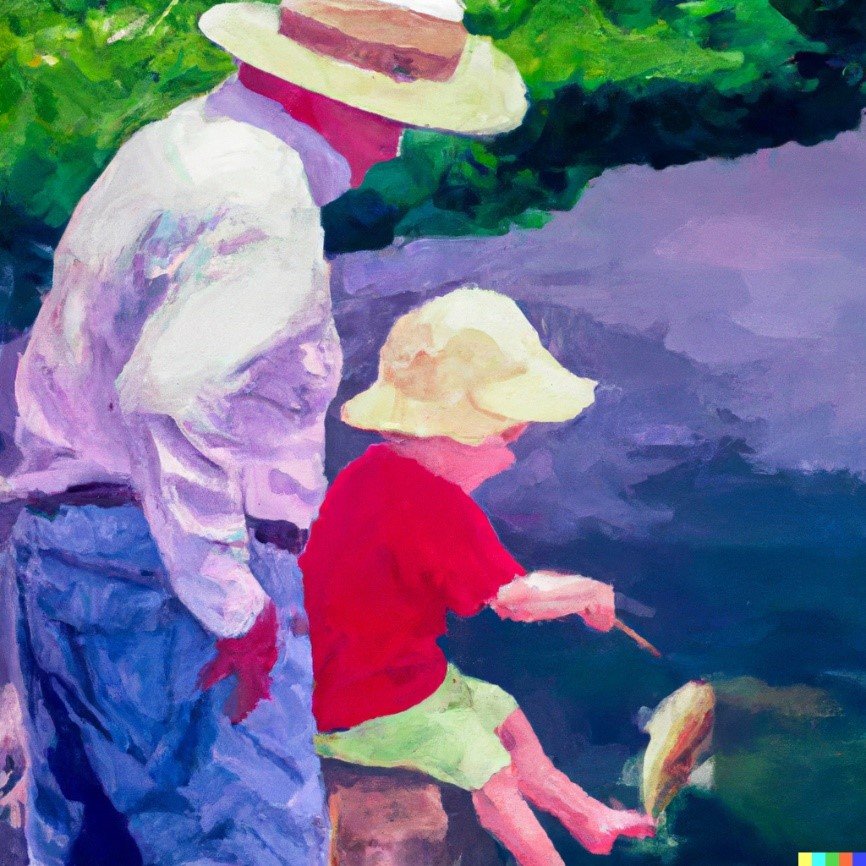

# Was ist Personal Coaching {#sec-was-ist-personal-coaching}

Bevor du mit der Theorie startest ist es immer ratsam sich selbst Gedanken zu machen und zu schauen was das allgemeine Verständnis zu einem Thema ist. Wir primen dich damit auf für die Inhalte die kommen. Daher beginnen wir mit einer Selbststudiumsaufgabe[^4-whatspc-1].

[^4-whatspc-1]: Wenn du in der Übungen Personal Coaching in diesem Semester eingeschrieben bist findest du alle SSAs und eine Möglichkeit diese zu beantworten auf [Moodle](https://moodle.univie.ac.at/my/). Nicht alle SSAs werden hier im Skriptum angegeben. Halte dich also über dein Moodle Board informiert was zu tun ist.

**Was macht eine\*n gute\*n PC aus?**

*Sprich mit mindestens drei Personen aus deinem Umfeld. Wähle dazu, wenn möglich sehr unterschiedliche Personen aus (Alter, Geschlecht, Trainingserfahrung, Gesundheitszustand…). Frage sie, was sie von Personal Training halten und was sie sich von den Coaches erwarten würden. Was wäre ihnen wichtig? Sammle die Antworten als Stichworte. Dann setze dich hin und mache dir ein paar Minuten selbst dazu Gedanken. Was sind wichtige Eigenschaften und Kompetenzen von PTs?\
Schreibe dann deine Ergebnisse in Stichworten auf.*

## Berufsbild – zwischen Medizin und Freizeit {#sec-berufsbild}

Im Coaching geht es darum, Menschen in einer privaten oder beruflichen Situation zu begleiten und zu unterstützen. Meist werden spezifische Probleme oder Lebensbereiche behandelt. Coaching spielt sich immer im **nicht-klinischen Setting** ab und unterscheidet sich vorrangig dadurch von der Therapie [@greifWarumUndWodurch2012]. Mit PC beziehen wir uns hier vorrangig auf die körperliche Gesundheit und Fitness. Es sollte uns jedoch klar sein, dass wir mit ähnlichen Methoden und Wirkungsweisen arbeiten müssen, wie sie in der Business-Beratung, der Psychotherapie und der Physiotherapie eingesetzt werden. Daher ist ein Coaching Prozess nicht gleichzusetzen mit der Arbeit von Fitness-Instruktor\*innen. Letztere Personen beschränken sich auf die Vergabe eines „Workouts“ oder eines Trainingsplans. Workouts haben einen Erfahrungswert und sind vielleicht Entertainment. Training ist ein gezielter, (mehr oder weniger streng geleiteter) Prozess zur Verbesserung von Leistungsfähigkeit oder physiologischer Mechanismen. Sie sind aber nicht zu vergleichen mit Coaching. Der Unterschied liegt im bekannten Sprichwort *jemandem einen Fisch zu geben oder jemandem das Fischen zu lernen.* Letzteres kann als Coaching Prozess angesehen werden. **Es ist die Hilfe zur Selbsthilfe**.

{#fig-fish width="400"}

Der Beruf **Personal Coach** (PC) oder **Personal Trainer** (PT) ist kein gut umrissener Begriff. Beides wird hier als Synonym verwendet. Ein\*e PC bewegt sich thematisch und inhaltlich in einem rechtlichen und professionellen Spannungsfeld. Kompetenzen reichen in die Medizin, Psychologie, Ernährungswissenschaft, Trainingswissenschaft, Biomechanik, Pädagogik und mehr. Trotzdem sind PCs keine Psycholog\*innen, keine Physiotherapeut\*innen und keine Diätolog\*innen. Die Grenzen dieser klar definierten Professionen müssen gewahrt werden, auch wenn wir uns ihrer Wissenschaften und Methoden bedienen. Leider ist es in der Praxis nicht immer einfach zu erkennen, wo die eigene Kompetenz endet. So bewegen sich viele PCs in einem Graubereich. Das bedeutet nicht zwangsweise, dass sie damit Klient\*innen schädigen oder schlechte Arbeit machen. Dieser Schwierigkeit sollte sich jedoch jede\*r PC klar sein. PCs sind Dienstleister\*innen und fungieren nicht als medizinische Berufsgruppe! Trotzdem sind sie in das Gesundheitsverhalten und die Gesundheitsentscheidungen ihrer Klient\*innen mit eingebunden.

Sportwissenschafter\*innen arbeiten ausschließlich in der *Medizinischen Trainingstherapie* auch mit Patient\*innen. Bis Ende 2024 steht ihnen diese Arbeit lediglich im Angestelltenverhältnis unter ärztlicher Leitung frei. Mit der Gesetzesnovelle, die im Juli 2024 beschlossen wurde, ist es auch möglich freiberuflich zu arbeiten. Das Gesetzt tritt ab 01.01.2025 in Kraft [Gesetzestext RIS](https://www.ris.bka.gv.at/Dokumente/BgblAuth/BGBLA_2024_I_100/BGBLA_2024_I_100.html). <!--# work this [position statement](https://www.researchgate.net/publication/381654675_POSITION_STATEMENT_Position_statement_regarding_the_current_standing_of_exercise_therapy_in_Austria_Positionspapier_zur_Situation_der_Trainingstherapie_in_Osterreich) in here or in the chapter about training -->

## Werteentwicklung Gesundheit und Fitness



Gesundheit und ein sportliches Äußeres sind hohe Werte in unserer Gesellschaft. Diese Entwicklung ist zurückzuführen bis in das späte 19te Jahrhundert. Die Idee von Fitness, den Körper zu verändern und jung und fit zu sein waren damals nicht nur mit nationalistischen sondern auch mit religiösen Motiven verbunden.

Nicht nur in Deutschland des Nationalsozialismus, sondern auch in den USA der 1960 unter Ronald Reagan wurde Fitness und ein allgemeiner Körperkult groß geschrieben [@andreasson2014Fitness].



Fitness, ein fittes Äußeres und Gesundheit sind keine an sich politischen Werte, sie wurden und werden jedoch als solche instrumentalisiert. Als Sportwissenschafter\*innen und Personal Coaches leben wir oft in der Blase die uns vorgaukelt diese Werte wären universell. Jedoch gibt es ganz klar Gruppen an Personen, die wir erreichen und unterstützen können und andere für die Barrieren bestehen oder die andere Werte als wesentlich höherrangig betrachten.

PC stehen ganz klar für eine spezifisches Weltbild, das in der heutigen Zeit (anders als im Westen vor 100 Jahren) **individuelles** **Wachstum** und **Selbstoptimierung, sowie traditionellere Werte wie Jugendhaftigkeit, Leistung** und **Gesundheit** klar in den Vordergrund stellen. Wir sollten uns damit auch klar sein, dass es dazu auch konträre Denkrichtungen und Wertvorstellungen gibt, die wir nicht bedienen können.

## Gesundheit und Prävention

Als nicht-klinische gesundheitsorientierte Profession können PCs als Zwischenglied zu dem medizinischen Fachpersonal fungieren. Ihre Aufgabe ist es unter anderem **präventive Methoden** (Training, Alltagsbewegung allgemeines Gesundheitsverhalten…) zu erkennen, zu verstehen und zu **unterstützen**. Außerdem können Sie als Teil der Früherkennung Klient\*innen an medizinische Professionen **weiterleiten**. Durch kompetentes Coaching (zum Beispiel durch die Unterstützung beim Suchen einer geeigneten Ärztin oder Therapeutin) können Barrieren reduziert und das Gesundheitsverhalten verbessert werden.

Schließlich agieren Coaches auch als Vorbilder im Bereich Fitness und Gesundheit. Sich dieser Vorbildrolle bewusst zu sein ist von hoher Bedeutung, da sie auch eine Schattenseite hat (siehe @sec-berufsethik).

Die NSCA (accessed [2024](https://www.nsca.com/certification/csps/)) definiert Personal Training als:

*\[...\] professionals who, using an individualized approach, assess, motivate, educate and train clients regarding their personal health and fitness needs. They design safe and effective exercise programs, provide the guidance to help clients achieve their personal health/fitness goals, and respond appropriately in emergency situations. Recognizing their own area of expertise, a personal trainer will refer clients to other health care professionals when appropriate.*

Insgesamt können viele Aufgaben unter den Zuständigkeitsbereich der Coaches fallen:

-   Zielfindung und Unterstützung in der Umsetzung
-   Motivationale Unterstützung
-   Übungen anleiten, beschreiben, strukturieren
-   Training planen, überprüfen und anpassen
-   Ehrliches Feedback geben
-   In anderen Bereichen weiterhelfen (Ernährung, Gesundheitsfragen)
-   Gesundheitsverhalten coachen
-   Für Sicherheit im Training sorgen

## Literatur
