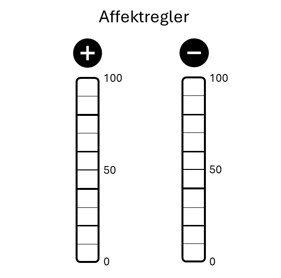

```{r, echo= FALSE, message= FALSE}
library(tidyr)
library(dplyr)
library(kableExtra)
library(readxl)
load("metadata.rds")

#set all tables to this form
mykable <- function(df){
  knitr::kable(df, digits = 2, align = "c", escape = F) %>%
    kableExtra::kable_styling(font_size = 12) %>%
    kable_styling(full_width = F)
  }

```

# Selbststudiumsaufgaben - SSA

Die SSAs erscheinen wöchentlich im Moodle Kurs zum Seminar. Beachte, dass es unterschiedliche Kriterien zum Erfüllen der Aufgaben gibt. Für machen reicht es, wenn du ein kurzes "ok" im Antwortenfeld hinterlässt. Dies ist vor allem dann der Fall, wenn die Antworten potentiell persönliche Informationen von dir oder deinen Klient\*innen beinhalten könnten. Bei anderen Aufgaben musst du eine Datei hochladen oder kurze Antworten (stichwortartig) hinterlassen.

## Organisation

### Semesterplan

**Start:** Erste Einheit\
**Dauer:** 2 Wochen\
(Aufgrund der Möglichkeit, dass Studierende erste in der zweiten Einheit eingeschrieben werden können.)

**Beschreibung:**\
Verschaffe dir Überblick im Skript und auf Moodle. Plane das Semester!

**Aufgabe:**\
"Planen ist alles, ein Plan ist nichts!" - Eisenhower

Organisiert zu sein und vorausschauend zu planen, ist eine der wichtigsten Kompetenzen als Coach. Klient\*innen verlassen sich auf deine zeitnahe und voraussehnede Bearbeitung ihrer Anliegen. Vorbereitet zu sein, ist außerdem ein erlernbarer und machbarer *Skill*. Deine ersten Aufgaben beziehen sich gleich darauf:

1)  Lies die Einleitung im Skriptum (@sec-einleitung). Hier findest du alle Informationen zum Ablauf der LV.
2)  Schreibe dir auf was unklar ist. Besprich es mit Kolleg\*innen und bring offene Fragen zur nächsten Einheit.
3)  Zücke deinen Kalender versichere dich, dass du bei allen Terminen (voraussichtlich) Zeit hast. Sprich geplante Abwesenheiten direkt in der nächsten Einheit an.

Als abgeschlossen gilt diese Aufgabe, wenn du ein "OK" in das Textfeld schreibst.

### Schaffe dir Platz im Kalender

**Start:** Erste Einheit\
**Dauer:** 2 Wochen\
(Aufgrund der Möglichkeit, dass Studierende erste in der zweiten Einheit eingeschrieben werden können.)

**Beschreibung**\
Plane fixe Zeitfenster in denen du dich mit dem Seminar beschäftigst.

**Aufgabe**\
Dieses Seminar hat 2 ECTS (= 50 - 60h) und etwas mehr als die Hälfte dieser Zeit (\~ 30h) wirst du NICHT in den Präsenzeinheiten (20 - 22h) aufwenden (siehe @sec-einleitung).

Von Semester Anfang bis vorlestungsfreie Zeit sind es ca. 15-16 Wochen. Das ergibt für die 30 Arbeitsstunden ca. 2h Arbeit pro Woche.

Du hast wöchentliche kurze Aufgaben (wie diese hier). Plane für die kommenden **4 Wochen** jeweils zwei Blöck von **30-60min** pro Woche für die Erfüllung dieser SSAs, sowie Planung und Dokumentation der Personal Coachings. Trage sie **jetzt** in deinen Kalender ein.

Versuche realistische Zeitfenster zu planen, die du auch wirklich einhalten kannst.

Anschließend hast du 4 Wochen Zeit, dich zu üben konsistent zu sein. Denke daran, dass eine ähnliche Situation auf deine Klient\*innen zukommen kann. Sie "sollen" einen Trainingsplan einhalten. Nicht immer ist das zu schaffen und es kommen verschiedene Herausforderungen zum Vorschein, die sie an den Trainingseinheiten hindern. Es bedarf Übung, sich an einen Plan zu halten. Jedes mal, wenn du es schaffst wird es etwas einfacher. Wie im Training gilt:

**Consistence is Queen!**

## Berufsethik und Berufsbild

### Angebotsrecherche

**Start:** Woche 2\
**Dauer:** 1 Woche

**Beschreibung**\
Du findest Informationen zum Beruf des Personal Coach oder Personal Trainer\*in im Kapitel Was ist Personal Coaching (@sec-was-ist-personal-coaching).

Was bieten Personal Trainer\*innen rund um Wien oder in anderen Gegenden?

**Aufgabe**\
Schaue dir unterschiedliche Web-Auftritte von Personal Trainer\*innen an. Du kannst Webseiten und Social Media einsetzen.

Welche Angebote gibt es? Welche Marketingstrategien werden eingesetzt? Welche Zielgruppen werden angesprochen? Wie sind Trainer\*innen ausgebildet? In welchem Arbeitssetting arbeiten sie (Hometraining, online, Studio, ...) Was fällt dir sonst ein?

Trage stichwortartig deine Erkenntnisse zusammen und bringe sie als Diskussionsmaterial zur nächsten Einheit.

### Was macht gute PCs aus?

**Start** Woche 2\
**Dauer** 1 Woche

**Beschreibung:**\
Du findest Informationen zum Beruf des Personal Coach oder Personal Trainer\*in im Kapitel Was ist Personal Coaching (@sec-was-ist-personal-coaching). Lies dir das Kapitel durch. Anschließend sprich mit potentiellen Klient\*innen von Coaches.

**Aufgabe:**\
Bearbeite im im Laufe der Woche diese Aufgaben und beschreibe im Antwortfeld kurz deine Erkenntnisse.

Sprich mit mindestens drei Personen aus deinem Umfeld. Wähle dazu, wenn möglich sehr unterschiedliche Personen aus (Alter, Geschlecht, Trainingserfahrung, Gesundheitszustand…). Frage sie, was sie von Personal Training halten und was sie sich von den Coaches erwarten würden. Was wäre ihnen wichtig? Sammle die Antworten als Stichworte. Dann setze dich hin und mache dir ein paar Minuten selbst dazu Gedanken. Was sind wichtige Eigenschaften und Kompetenzen von Trainer\*innen? Schreibe deine Ergebnisse in Stichworten auf.

## Erstelle eine Berufsethik

**Start:** Woche 2\
**Dauer:** 2 Wochen

**Beschreibung**\
**Eine Berufsethik schützt!** Du findest Informationen zur Ethik im Kapitel Berufsethik und Berufsbild (@sec-berufsethik). Erstelle in dieser SSA deine eigene Berufsethik.

**Aufgabe:**\
Lies die vorgeschlagenen ethischen Grundlagen der verschiedenen Berufsgruppen und überlege dir, wie ein ähnliches Dokument für PCs aussehen könnte. Was wären die für dich wichtigsten Punkte, die du in einer solchen Berufsethik sehen möchtest? Beschreibe im Antwortfeld deine wichtigsten Punkte der Berufsethik für Personal Coaches.

## Ziele setzen

### Deine Ziele

**Start:** Woche 3\
**Dauer:** 1 Woche

**Beschreibung**\
Genauso wichtig wie die Ziele deiner Klient\*innen, sind deine Ziele. Werde dir deiner Ziele bewusst! Für diese Aufgabe brauchst du ein bis zwei Blatt Papier, einen Stift (analog ist wirklich besser) und 20-30min ungestörte Zeit.

**Aufgabe:**\
Es gibt viele verschiedene Zielsetzungsübungen. Eine, die auf der Zuschreibung deiner Werte basiert, haben wir wahrscheinlich in der LV ausprobiert. Hier ist eine andere. Geh mit frischer Neugierde hinein - *Shoshin*

Nimm dir deinen Zettel und Stift zur Hand, um die Punkte der Reihe nach zu bearbeiten. Schließe am Ende die Aufgabe ab indem du ein "OK" oder eine sonstige Anmerkung in das Textfeld schreibst. Deine persönlichen Ziele musst du hier nicht mitteilen!

1.  **Quo Vadis?** Welche Ziele in Bezug auf Bewegung Gesundheit oder Training hast du? Alles was dir einfällt. Frei aus dem Bauch heraus und stichwortartig.

2.  **Via Negativa!** Schaue dir deine Ziele an und setze Prioritäten. Schaffst du es zumindest die Hälfte der Ziele zu streichen? Was bleibt übrig, das dir wirklich im Moment am Herzen liegt? Je mehr du streichst, desto mehr Fokus und Erfolg bleibt übrig! Schreibe die übrigen gebliebenen Ziele, noch einmal auf ein neues Blatt Papier. Was machst du mit den anderen Ziele, die du davor gestrichen hast? Diese sind auch wichtig! Denn diese zu verfolgen gilt es dringend zu vermeiden! Bewahre dir also den Zettel mit den gestrichenen Zielen ebenfalls auf.

3.  **Affektbilanz!** (Storch & Tschacher, 2016) Schau dir jedes dieser wichtigen Ziele einzeln an und bewerte auf zwei Skalen:

    3.  Löst dieses Ziel und die Arbeit an diesem Ziel etwas Positives in dir aus? Auf einer Skala von 0-100, wie positiv sind deine Emotionen, wenn du an das Ziel denkst.
    4.  Löst dieses Ziel und die Arbeit an diesem Ziel gleichzeitig etwas Negatives in dir aus? Auf einer Skala von 0-100, wie negativ sind deine Emotionen, wenn du an das Ziel denkst.

    Verwende dazu den Affektregler für jedes einzelne Ziel. Wichtig ist, dass du dir dabei etwas Zeit lässt und dir das Erreichen der Ziele und die Arbeit an den Zielen so körperlich wie möglich vorstellst.

    {#fig-affekt width="400"}

4.  **Objective!** Gibt es eine übergeordnetes Thema für deine Ziele? Versuche eine Art Überschrift zu finden. Ein Titel soll kurz und knackig sein. Gestalte ihn wie einen Leitspruch, Werbeslogan oder einen Buchtitel. Formuliere ihn positiv! (Beispiel: "Training als Stütze"; "Mein Weg zum ersten Halbmarathon"; "Ausgeglichen und Effektiv")

5.  **Die 5-Minuten Aktion!** Was kannst du heute tun, um deinem Ziel ein kleines Stück näher zu kommen? Versuche eine Aktion zu setzen, die maximal 5 Minuten in Anspruch nimmt und die Kugel ins rollen bringt. Reflexion und planen sind gut, aber Aktion bringt Wandel!

6.  **Hilfe Ansuchen!** Wen kannst du um Hilfe bitten? (Freund, Familie, Kollegen Lehrbeauftragte, ...) Überlege dir auch wie dir diese Person konkret helfen kann und bitte Sie genau darum.

Diese Aufgabe bestätigst du mit "ok".

## Ananmese und Erstkontakt

### Erstelle einen Anamnesebogen

**Start** Woche 4\
**Dauer** 2 Wochen

**Beschreibung:**\
Erstelle einen Anamnesebogen. Verwende ein eigenes Design, das übersichtlich und professionell wirkt.

**Aufgabe:**\
Überlege dir, wie du deinen Anamnesebogen einsetzen möchtest. Verbreitete Ansätze sind:

-   Die Klient\*innen füllen diesen im Vorhinein alleine aus und ihr besprecht dann die Antworten gemeinsam. So haben sie Zeit sich Gedanken zu machen. Wenn du den ausgefüllten Bogen schon im Vorhinein zurück bekommst, kannst auch du dich besser vorbereiten. Bitte beachte, dass der Anamnesebogen sensible persönliche Daten enthält. Daher sollte er über ein sicheres Medium an dich gesendet werden.

-   Du füllst den Fragebogen in einem gemeinsame Gespräch vollständig aus. Dies hat den Vorteil, dass die Klient\*innen nicht vorher schon etwas erarbeiten müssen. Für viele ist das Ausfüllen der Daten (womöglich bevor sie dich persönlich kennen) eine unangenehme Hürde. Im gemeinsamen Gespräch kannst du außerdem tiefere Einblicke sammeln als es vielleicht durch den strukturierten Bogen alleine möglich ist. Klient\*innen sprechen selbstständig für sie wichtige Themen an und auch du hast mehr Freiheit.

-   Du lässt nur die wichtigsten Punkte (medizinisches Risk-Assessment und Kontaktdaten) von den Klient\*innen ausfüllen, startest in ein Training und füllst im Laufe des Coaching Prozesses mehr und mehr aus, um es dann erneut aufzugreifen und mit den Klient\*innen abzusprechen. Dies bietet den schnellsten Einstieg in das, was den meisten Klient\*innen wichtig ist - das eigentliche Training. Es bedarf jedoch mehr Struktur von deiner Seite, da dir wichtige Informationen vielleicht noch fehlen und du diese im Nachhinein erfragen und eintragen musst.

Gib deinen fertigen Anamnesebogen unten als PDF oder Word-Datei ab und kommentiere, wie du den Bogen einsetzen möchtest.

### Plan Update

**Start:** Woche 4\
**Dauer:** 1 Woche

**Beschreibung:**\
Als Coach hältst du den Raum für Veränderungen. Du lädst zu Veränderungen ein, planst die Schritte und kontrollierst den Erfolg. Im Anschluss Evaluierst du die Handlungen und Ergebnisse, um so die weiteren Schritte zu setzen.

In diese Übung wirst du deinen persönlichen Semesterplan updaten.

**Aufgabe:**\
Vor 4 Wochen hast du dir einen Plan erstellt, der dich durch das Semester führt. Du hast dir damals wöchentliche Zeitfenster zur Bearbeitung der Aufgaben in deinen Kalender eingetragen.

Seither hast du neue Informationen gesammelt. Setze deinen Coaching-Hut auf und gehe die letzten Wochen gedanklich durch.

Hat deine Herangehensweise geklappt? Mit welchen Aspekten bist zu zufrieden? Wo solltest du nachjustieren? Du hast dich auch mit deinen persönlichen Zielen auseinandergesetzt. Beziehe diese ebenfalls mit ein und erstelle einen verbesserten Plan für die nächsten 4 Wochen. Du kannst dir wieder Zeitfenster in deinen Kalender eintragen oder eine andere Strategie überlegen. Dieses mal kannst du dir auch Gedanken dazu machen, wie du den Erfolg deiner Strategien messbar machen kannst. Ein "OK" bestätigt, dass du die Aufgabe durchgeführt hast.

## Volition und Verhalten

**The goal is to keep the goal the goal!**\
- Dan John

Motive, Ziele, eine klare Strategie und ein System sind die Zutaten für den Erfolg. Du hast dich bereits etwas mit den Zielen beschäftigt. Nun ist es an der Zeit, dir Strategien zurecht zulegen. Bearbeite in dieser Woche Handlungspläne und Bewältigungspläne.

### Konkrete Pläne

**Start:** Woche 5\
**Dauer:** 2 Wochen

**Beschreibung:**\
Du findest in Skript einen kurzen Abschnitt zu Handlungsplänen und Bewältigungsplänen (@sec-ziel-handlung).

**Aufgabe:**\
Deine Klient\*in und du entscheiden sich für grobe Strategien, um Ziele zu erreichen. Die Klient\*in könnte zum Beispiel einen dieser Sätze sagen:

-   "Ich *will* weniger Fleisch essen."
-   "Ich *muss* früher ins Bett gehen."
-   "Ich *sollte* im Büro die Treppen nehmen anstelle des Aufzugs."
-   "Ich *darf* abends vor dem zu Bett gehen Instagram nicht mehr öffnen."
-   "Ich *will* meinen Bizeps aufblasen."[^appendix1-ssa-1]

[^appendix1-ssa-1]: Beachte auch die Modalverben, die hierbei verwendet werden können. In der Einheit zu Motivation werden wir diese im **Change Talk** (Motivational Interviewing) wieder finden.

Ob diese "gute" oder "schlechte" Strategien sind sei fürs Erste dahingestellt. Um die Strategie der Klient\*in zu unterstützen, wäre es jedenfalls hilfreich einen konkreten **Handlungsplan** zu erstellen. Welche Handlungspläne kannst du für jeden dieser Punkte finden? Wie könnte die Klient\*in jeden Satz als Handlungsplan formulieren? Schreib diese ins Antwortfeld.

**Prepare to fail!** Manche Klient\*innen wollen es nicht hören (vielleicht willst auch du es auch nicht hören), aber es wird definitiv Zeiten geben in denen das System nicht funktioniert und wir unserer Handlungspläne nicht einhalten können/wollen.

Diese Situationen sollten wir antizipieren und einen **Bewältigungsplan** dafür errichten.

Finde Bewältigungspläne für jeden der oben genannten Sätze und schreibe sie ins Antwortfeld auf Moodle.

## Autonomie im Training

Einerseits wollen deine Klient\*innen, dass du deine Kompetenzen einsetzt, um ihnen den "perfekten" Trainingsplan und die "optimalen Lösungen" für ihre Ziele vorzulegen. Andererseits wollen sie und du, dass sie selbstständig in ihrem Gesundheits- und Bewegungsverhalten werden.

Werden Menschen selbstständiger und erfahren mehr über sich und ihr Verhalten, bleiben sie auch aufmerksam und sind leichter zu coachen.

Einige Studien unterstützen die Hypothese, dass Autonomie allgemein zu höherer Motivation und Erfolg führt. Es sollte also immer euer Ziel sein, eure Klient\*innen so autonom zu machen, wie es gerade im Moment möglich ist. Manche sind unsicherer im Umgang mit Training, andere musst du etwas bremsen. Allgemein gilt jedoch - gib ihnen Kompetenzen und lasse sie mitbestimmen!

Lies im Kapitel Trainingsplanung (@sec-trainingsplanung) im Skript.

### Minimal Effektiver Plan

**Start:** Woche 6\
**Dauer:** 2 Wochen

**Beschreibung:**\
Wir wollen oft den "perfekten Plan" ausarbeiten und haben hohe Ansprüche an Volumen und Intensität, das wir investieren möchten. Zumeist ist das aber nicht möglich und auch nicht zielführend. In dieser Aufgabe versuchst du genau den gegenteiligen Weg zu gehen. Was denkst du, dass die eine wichtigste Komponente ist, die deine Klient\*in durchführen muss, damit der Coaching-Prozess erfolgreich ist?

**Aufgabe:**\
Beginne bei einem Gedankenexperiment. Beschreibe die EINE Strategie, die du denkst, dass deine Klient\*innen machen sollten. Sprich dann im Anschluss mit ihnen und versuche herauszufinden, was sie dazu denken. Wo können sie sich vorstellen zu starten? Was denken sie, dass die eine wichtigste Komponente ist? Spiele dabei mit ihnen das **Gedankenexperiment**: "Wenn wir nur eine Sache machen könnten - was wäre es?" Setzt dann das Experiment in die Tat um und schreibt einen "**Minimal-effektiven Plan**" (MEP). Bedenke aber, dass der MEP auch machbar und erstrebenswert (/lustvoll) für die Klient*innen sein sollte! Diesen MEP kannst du natürlich in unterschiedlicher Weise* framen*. Er kann die Basis und alles andere ist nur das Topping oder du beschreibst diesen Plan als Backup oder Joker. Diesen Joker können sie einsetzen, wenn sie nicht dazu kommen ein ganzes Training zu machen. Spiele dich mit der Beschreibung und Einbettung dieser Idee in dein Coaching. Überlege dir was für deine Klient*innen den effektiveren Anreiz setzt.

Deiner Fantasie in der Umsetzung sind keine Grenzen gesetzt. Gestalte es attraktiv! Denke auch daran, dass physische Erinnerungen (ein kleiner Notizzettel, eine Erinnerung am Mobiltelefon, strategisches platzieren von Sportequipment in der Wohnung, ...) Wunder wirken können. Eine tägliche *Cecklist* für den MEP oder eine regelmäßige Textnachricht können unterstützen. Du kannst auch die Abmachung verschriftlichen und einen "Trainingsvertrag mit mir selbst" für deine Klienten gestalten. Ihr unterschreibt darauf beide, um diesen "gültig zu machen". Alles ist möglich! Beschreibe kurz deinen Prozess im Antwortfeld.

### Erhöhe Autonomie im Training

**Start:** Woche 6\
**Dauer:** 3 Wochen

**Beschreibung:**\
In dieser Aufgabe versuchst du, Klient\*innen etwas mehr Selbstständigkeit zu geben.

**Aufgabe:**\
Diese Übung kann sehr unterschiedlich ausfallen. Je nachdem wo deine Klient\*innen schon stehen, kannst du mehr oder weniger Autonomie zulassen.

Hier ein paar Beispiele was du machen kannst:

-   Lass eine Übung im Trainingsplan frei. Zum Beispiel könnte die letzte Übung in einem Krafttraining komplett frei sein oder du gibst vor, dass sie eine Bauchübung ihrer Wahl machen können. Für einen speziellen Lerneffekt kannst du auch Restriktionen in der Freiheit einbauen. z.B.: "Finde eine Bauchübung bei der du gerade mal 15-20Wh schaffst." oder "erfinde eine neue Übung mit dem Gymnastikball."

-   Lasse bei einem gemeinsamen Training die Klient\*innen entscheiden, welche Abzweigung ihr beim Lauftraining nehmt.

-   Überlasse deiner Klient\*in das Pacing anstatt es vorzugeben. Ein spezieller Twist dieser Idee kann sein, dass du ihre Herzfrequenz überwachst und sie bittest in einer speziellen Herzfrequenzzone zu laufen (ohne einen Blick auf die Uhr). So lernt sie auch mehr subjektive Anstrengung zu beurteilen und lernt ihren Körper kennen.

-   Gib Wahlmöglichkeiten direkt im Trainingsplan vor, die kaum Unterschiede im Trainingseffekt machen (z.B. Pushups oder Bankdrücken).

-   Lass sie die Reihenfolge der Trainings in der Woche selbst entscheiden. Also anstatt vorzugeben Montag ist Dauerlauf, Mittwoch Intervalle und Freitag Krafttraining, gibst du nur vor, dass diese drei Inhalte innerhalb einer Woche durchgeführt werden sollten. Die Reihenfolge lässt du sie Woche für Woche selbst entscheiden.

Denke daran diese Ideen mit den Klient\*innen zu reflektieren. Es kann interessant für sie und dich sein, wenn ihr euch überlegt warum sie z.B. die Reihenfolge so gewählt haben. Unterstütze und verstärke ihre Entscheidungen auch. Nicht jeder Tag ist gleich und sie sollten lernen auch auf ihren Körper zu hören.

Viel Spaß mit der Umsetzung.

Beschreibe kurz was du gewählt hast.

## Motorische Lernen

### Motorisches Lehren

**Start:** Woche 7\
**Dauer:** 1 Woche

**Beschreibung:**\
Lies das [Kapitel Motorische Lernen](https://bookdown.org/peter_raidl/personalcoaching_script/11-MotorLearning.html) im Skript und formuliere eine Strategie, die du davon mitnehmen und mit deinen Klient\*innen einsetzen möchtest.

**Aufgabe:**\
Beschreibe kurz welche Idee aus der Einheit und dem Skriptum zu Motorisches Lernen, du mit deinen Klient\*innen umsetzen wirst.

## If Sh\*t goes south

### Erwarte Niederlagen und sprich es an

**Start:** Woche 8\
**Dauer:** 2 Wochen

**Beschreibung:**\
Besprich mit deinen Klient\*innen was bisher nicht geklappt hat und was in Zukunft ebenfalls zur Herausforderung werden könnte. Diese Aufgabe klingt einfacher als sie ist. Vielleicht hattet ihr schon ein paar Motivationale Hürden und deine Klient\*innen handeln nicht so wie ihr das erwartet habt. Möglicherweise ist es an der zeit für eine "Crutial Conversation" [@grennyCrucialConversations3E2021].

**Aufgabe:**\
Wir müssen damit rechnen, dass manche unserer Interventionen nicht klappen. Es kann jemand krank werden oder sich verletzen oder die Ziele können sich ändern. An manchen Tagen verlässt einen die Motivation oder die Arbeit ist wichtiger als das Training.\
Sprich mit deinen Kund\*innen. Vielleicht hattet ihr schon ein oder zwei Hindernisse in eurem Prozess oder ihr könnt gemeinsam herausfinden welche Hindernisse auf euch zukommen könnten. (Vielleicht Stehen Feiertage vor der Tür?)

Mache ihnen dabei auch klar, dass Rückschläge normal sind, wir uns aber bemühen können den Schaden so gering wie möglich zu halte und den Schwung nicht verlieren.

Hier ein paar Fragen, die du verwenden kannst:

-   "Ich habe hier den Anamnesebogen von dir und du hast mir damals gesagt, dass das Ziel X dir sehr wichtig ist und du sehr motiviert bist daran zu Arbeiten. Wie hat sich das in den letzten Wochen deiner Einschätzung nach entwickelt?

-   "Wir haben einen Minimal Effektiven Plan erstellt und du hast mir gesagt, dass du es schaffen wirst diesen Plan XY drei mal die Woche durchzuführen. Laut meinen Aufzeichnungen hast du es einmal pro Woche geschafft. Was denkst du ist der Grund dafür?" --\> Was sollten wir machen, damit es in den nächsten Wochen besser funktioniert?

-   "Du hast mir im letzten Training gesagt, dass du froh bist, dass ich dich im Training so pushe. Du würdest das sonst so nicht machen. Es freut mich, dass ich dir helfen kann. Gleichzeitig steht auch das Ende unserer Zusammenarbeit bevor. Wie denkst du wird es für dich dann im Training weiter gehen?

-   "Was könnte dich in den nächsten Wochen an der Durchführung unseres Trainingsplans hindern?"

-   "Wir haben schon einige Fortschritte gemacht. (nenne konkrete, objektive Fortschritte oder Aussagen der Klient\*innen). Ich möchte unbedingt, dass das so bleibt. Da das Leben einem manchmal einen Strich durch die Rechnung macht sollten wir uns auch mit möglichen weiteren Hindernissen beschäftigen. Wo siehst du die größten Herausforderungen, um deinem Ziel näher zu kommen?"

-   "Was waren in der Vergangenheit Gründe, aus denen du mit dem Training aufgehört hast/ du nicht an dein Ziel gekommen bist?"

    "Was würde dir helfen, mit diesen Herausforderungen umzugehen?"

    "Was könnten wir machen, um die Chance zu verringern, dass diese Schwierigkeiten wieder eintreten?"

    "Was machen wir wenn es trotzdem eintritt?"

### Handlungskette zum Erfolg

**Start:** Woche 8\
**Dauer:** 2 Woche

**Beschreibung:**\
Jeder Handlungsplan ist aus mehren kleinen Schritten zusammengesetzt. Die folgende Übung kannst du mit und für deine Klient\*innen durchführen oder für deine eigenen Ziele.

**Aufgabe:**\
Du hast dich schon mit deinen eigenen Zielen beschäftigt und einige Strategien implementiert. Mit dieser Aufgabe hebst du deine Interventionen (für dich oder einen deiner Klient\*innen) auf das nächste Level. Das Ziel ist es schwierig umzusetzende Startegien greifbarer zu machen.

1.  Nimm dir eines deiner unmittelbaren Ziele heraus und schreibe dir nochmal dein **Motoziel** und oder deine wichtigsten **Werte** heraus.\
    z.B.: Moto-Ziel "Sei die Veränderung, die du in der Welt sehen willst". Mein Ziel: Ich möchte als Coach meinen Coachees ein Vorbild sein, weil mir (Werte:) Verantwortung, Wirksamkeit und Gemeinschaft wichtig sind.

2.  Wie kommst du deinem Ziel näher? Versuche eine (nächste/neue) Handlung zu finden, die dich deinen Zielen näher bringt. Stelle dir diese Handlung vor und bemerke wie jede Handlung eigentliche eine Abfolge vieler kleinerer Handlungen ist. Versuche diese genau zu differenzieren.\
    z.B. Ausdauertraining. Unterteilt in: Laufschuhe aus dem Keller holen und etwas lüften; Batterie für Herzfrequenz-sensor beim Spar um die Ecke kaufen (vorher nochmal nachsehen welche Batterie ich benötige); Meiner Partner\*in mitteilen, dass ich heute Nachmittag eine Runde laufen gehe; Laufkleidung anziehen, ..., 30min laufen, ... duschen, mir überlegen wann ich das nächste mal gehe, in den Kalender eintragen, ... feiern, dass ich endlich wieder mal laufen war. Dies kann natürlich in unendlicher Granularität gemacht durchgeführt werden, **je genauer dein Bild ist, desto besser**.

3.  Erstelle einen konkreten **Handlungsplan** für dein Strategie und schreibe ihn dir auf. Mache den Handlungsplan zugänglich. Schreib ihn also auf ein Blatt Papier und lege ihn in deinen Kalender oder als Lesezeichen in dein Buch, klebe ihn an den Kühlschrank, den Laptop oder über den Klopapier-Halter.

4.  Erstelle einen **Bewältigungsplan**. Schreibe auch diesen auf und bewahre Ihn als "Reserve" z.B. in deinem Geldbeutel auf.

Bestätige die Aufgabe indem du in das Antwortfeld schreibst für/mit wem du die Übung gemacht hast (für dich/mit Klient\*in).

## Follow-up

Informale Gespräche mit den Klient\*innen sind das Um und Auf für effektives Coaching. Du schaffst damit eine direkte Verbindung von Mensch zu Mensch und damit Rapport und Buy-in.

Gleichzeitig können dir formale Fragebögen und Monitoring des subjektiven Befindens der Klient\*innen, helfen klarere Aussagen zu bekommen oder einen zeitlichen Verlauf eurer Zusammenarbeit zu konstruieren.

In dieser Lektion siehst du eine Möglichkeit eine Zwischenstand mit deinen Klient\*innen zu erheben. Außerdem sollst du deine Klient\*innen mit dem Handwerkszeug entlassen weiter an ihren Zielen zu arbeiten.\
Als letzte SSA sollst du eine Möglichkeit des Follow-ups schaffen. Nachdem deine Klient\*innen die Zusammenarbeit mit dir beendet haben wirst du sie (ca 2-4 Wochen später noch einmal kontaktieren.

### Formaler Zwischenstand

**Start:** Woche 9\
**Dauer:** 2 Wochen

**Beschreibung**:\
Hier siehst du eine Möglichkeit den Zwischenstand des Coaching Prozesses zu evaluieren. Nutze solche Fragebögen strategisch und besprich die Ergebnisse mit deinen Klient\*innen. Stimmen deine und ihre Einschätzungen überein? Wie stimmen sie mit den Angaben am Anfang des Prozesse überein?

[Google Formular Reflexion und Zwischenstand](https://docs.google.com/forms/d/e/1FAIpQLSfOVfIAiZ3KLRkWxkahJSP6bdWIT8bwXSCUCIPXqb3FbM3OIw/viewform?usp=sharing)r

Google Formulare ist ein einfach zu verwendendes Tool für (wiederholte) Befragungen deiner Klient\*innen. Hier im Beispiel findest du einen Reflexionsfragebogen.

Die Antworten lassen sich einfach in Tabellen zusammenfassen und Downloaden und deine kreierten Templates flexibel einsetzen. Du solltest dir nur sicher sein, dass deine Klient\*innen einen Google Service nutzen wollen. Vermeide es jedenfalls personalisierte Daten hier abzufragen.

Alternativ kannst du natürlich auch ausgedruckte Fragebögen mit nach Hause geben und sie wieder einsammeln.

**Aufgabe**:\
WICHTIG: Wir haben bereits sehr viele Tools mit deinen Klient\*innen in kurzer Zeit eingesetzt. Überlege dir gut, ob du diese Art der Zwischenreflexion auch benötigst. Bestätige dies Aufgabe nur mit "OK" und entscheide selbst was du damit machst.

### Post-Coaching Follow-up

**Start:** Woche 9\
**Dauer:** 6 Wochen

**Beschreibung:**\
Nachbesprechung Post-Coaching.

**Aufgabe:**\
Am Ende des Coaching Prozesse mit einen Klient\*innen solltest du in jedem Fall eine kurze Nachbesprechung einplanen. Vor allem sollte deinen Klient\*innen klar sein, wie sie alleine weiter an ihren Zielen arbeiten können. Schließlich biete ihnen an, dass du sie in 2-6 Wochen (vereinbare einen Zeitpunkt mit ihnen) noch einmal kontaktieren wirst. Du kannst diese letzte Kontaktaufnahme mit einem Formular, schriftlich (Email) oder als Gespräch (in-Person oder telefonisch) planen.

Versuche folgende Punkte im Follow-up zu erheben:

-   Wie blicken Sie jetzt auf den Coaching Prozess zurück?

-   Wie ging es ihnen in der Zeit in der du sie nicht gecoacht hast?

-   Sind noch offene Fragen oder Themen aufgetaucht mit denen du sie unterstützen kannst?

-   Wie geht es bei ihnen weiter? Wie planen sie weiterhin sportlich aktiv und gesund zu bleiben?

Bestätige mit "OK" und Behandle das Follow-up in deiner Abschlussarbeit für das Seminar.
